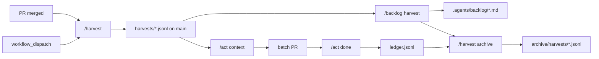

# /harvest

**Collect, don't fix.** `/harvest` is the upstream of the review-debt pipeline.
Whatever is gathered is the *raw material* — `/backlog` triages it into
priorities, `/act` fixes it on a branch, and `/backlog` archives the rows that
are now done. `/harvest` itself only:

1. Reads unresolved threads on a merged PR (`isResolved == false`, `isOutdated == false`).
2. Classifies by author (`config.json` → `ignore_authors` / `nit_authors`).
3. Writes one append-only file: `.agents/review-debt/harvests/{ts}-pr-{N}-run-{id}.jsonl`.
4. Pushes the new file to `main` (unique filename per run, no merge conflicts,
   no harvest bot PR).

Harvest is **not** part of `/act`. It does not run on every push, every CI run,
or every `/act` invocation. Triggers are: PR merge, post-PR-CI, manual dispatch.

## Layout

| Path | Purpose |
| ---- | ------- |
| `SKILL.md` | This file |
| `scripts/` | `harvest-threads.ts`, `harvest-debt-batch.ts`, `resolve-harvest-prs.ts`, `resolve-harvest-target.ts`, `land-harvest-files.sh`, `archive-harvest.ts`, `harvest-cli.ts`, `review-debt-{lib,gh,text}.ts` |
| `references/` | (reserved) |
| `project.json` | Nx targets (`harvest-skill:harvest-*`) |

The shared ledger types/helpers (`review-debt-lib.ts`, `review-debt-gh.ts`,
`review-debt-text.ts`) live here because they describe the harvest format.
`/act` (`query-debt.ts`, `plan-debt-batch.ts`, `update-debt-status.ts`) imports
them through a relative path; `/backlog` does the same.

## Files produced

| File | Owner | When |
| ---- | ----- | ---- |
| `.agents/review-debt/harvests/{ts}-pr-{N}-run-{id}.jsonl` | `/harvest` | Each harvest run |
| `.agents/review-debt/debt-summary.json` | `/harvest` (`buildSummary`) | Each run that changes the ledger |
| `.agents/review-debt/archive/harvests/*.jsonl` | `/harvest archive` | After `/backlog` triages a file |
| `.agents/review-debt/archive/harvests/*.archived.json` | `/harvest archive` | Marker with `archived_at` and row count |
| `.agents/review-debt/ledger.jsonl` | `/act done` | Status overlays (`done` / `wontfix` / `duplicate`) |
| `.agents/backlog/YYYY-MM-DD-<slug>.md` | `/backlog` | Triage decisions per row |
| Source PR resolved threads | `/act` P4 | Per-thread fix + reply, then resolve |

`/harvest` never touches `ledger.jsonl` and never edits `.agents/backlog/*`.
That separation is the **invariant** that keeps the three skills independent —
if you find yourself wanting to add a "status update" hook here, it belongs in
`/act done`, not in `/harvest`.

## Triggers

| Trigger | Scope | Use |
| ------- | ----- | --- |
| `pull_request` **closed** + merged | That PR only (immediate) | `harvest-threads.ts` |
| `workflow_run` **CI** completed on `pull_request` | Same merged PR, after PR CI | `resolve-harvest-target.ts` (workflow_run branch) + `harvest-threads.ts` |
| `workflow_dispatch` with filters | Batch by `--pr-ids` / `--merged-since` / `--last` / `--pr-author` / `--labels` / `--thread-author` | `harvest-debt-batch.ts` |
| Manual backfill | Single PR | `bun .agents/skills/harvest/scripts/harvest-threads.ts OWNER REPO PR` |

`land-harvest-files.sh` lands the new `harvests/*.jsonl` on `main` (rebase +
retry, unique filename per run → no bot PR).

## Entry points

```bash
# single PR
bun .agents/skills/harvest/scripts/harvest-threads.ts OWNER REPO PR --merged-sha SHA --run-id local

# batch with filters (mirrors workflow_dispatch inputs)
bun .agents/skills/harvest/scripts/harvest-debt-batch.ts OWNER REPO \
  --pr-ids 72,67 --dry-run
bun .agents/skills/harvest/scripts/harvest-debt-batch.ts OWNER REPO \
  --merged-since 2026-06-09 --last 5

# archive fully-triaged files (called by /backlog harvest, safe to call by hand)
bun .agents/skills/harvest/scripts/archive-harvest.ts --dry-run
bun .agents/skills/harvest/scripts/archive-harvest.ts

# convenience targets (root package.json)
bun run harvest:pr      -- 72 --dry-run
bun run harvest:batch   -- --pr-ids 72,67 --dry-run
bun run harvest:archive -- --dry-run
bun run harvest:test
```

`owner/repo` defaults from `gh repo view` in a clone (see `harvest-cli.ts`
`resolveGhRepo`). Pass `OWNER REPO` explicitly when running in CI without
`GITHUB_REPOSITORY`.

## Row schema

`DebtRecord` is the source of truth — see `scripts/review-debt-lib.ts:53-77`.
Highlights: `thread_id`, `thread_url`, `status: open|claimed|done|wontfix|duplicate`,
`priority: blocking|human|nit|scan|noise`, `needs: code_change|reply_only|skip`,
`source_pr`, `fingerprint` (sha256 of `body|path` — same nit across PRs collapses
in `--duplicates`), `area` (first two path segments), `harvested_at`,
`harvest_run_id`, `times_seen` (re-harvest bumps it).

`config.json` (`.agents/review-debt/config.json`):

```json
{
  "ignore_authors": ["dependabot[bot]"],
  "nit_authors": ["coderabbitai[bot]", "chatgpt-codex-connector[bot]"]
}
```

Tune on first real harvest; missed nits are easy to add later.

## Lifecycle (the full pipeline)



A row has four homes in its life, in this order:

1. **harvest file** (source of truth for body / fingerprint / path).
2. **backlog file** (priority decision: do it / wontfix / dup / etc.).
3. **ledger overlay** (`done` / `fix_pr` / `notes` after a fix PR merges).
4. **archive** (the harvest file is moved aside once all its rows are terminal).

The harvest file is the only one `/harvest` writes; the others belong to
`/backlog` and `/act`.

## Workflow

`.github/workflows/review-debt-harvest.yml` (renamed conceptually to
"review-debt-harvest", still the harvest workflow). It calls:

- `bun .agents/skills/harvest/scripts/resolve-harvest-target.ts` — event parser.
- `bun .agents/skills/harvest/scripts/harvest-threads.ts` — single PR.
- `bun .agents/skills/harvest/scripts/harvest-debt-batch.ts` — batch.
- `bash .agents/skills/harvest/scripts/land-harvest-files.sh` — push to main.

All paths in the workflow were updated as part of this split. Workflow name
stays `Review debt harvest` to keep `gh run list` filters stable.

## Boundaries — what /harvest does NOT do

| Concern | Owner | Why |
| ------- | ----- | --- |
| Triage (priority / grouping / wontfix) | `/backlog harvest` | Needs human or `/act` judgment |
| Code fixes | `/act <context>` | `/harvest` has no product code path |
| Status updates (`done` / `wontfix`) | `/act done` | Tied to fix PRs and source-PR threads |
| Resolve on source PRs | `/act` P4 | Requires per-thread reply |
| Editing `config.json` bot list | `/backlog` (or manual) | Triage is `/backlog`'s job |

If you find a `/harvest` script wanting to import `/act` or `/backlog`, stop —
that's a contract violation. The reverse (other skills importing `/harvest`'s
`review-debt-lib.ts`) is allowed and expected.

## Move to another repo

Copy `.agents/skills/harvest/` and `.agents/review-debt/`. The other skills
(`/act`, `/backlog`) only depend on `scripts/review-debt-{lib,gh,text}.ts` via
relative import — relocating `/harvest` relocates those transitively.

## Validation

```bash
bunx eslint .agents/skills/harvest/scripts/ --max-warnings 0 --no-error-on-unmatched-pattern
bun run harvest:test
```
