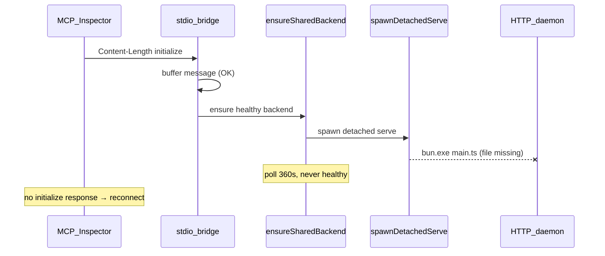

# Fix openadt-mcp shared backend cold-start (v1.3.16)

## 1. Initial user problem

After installing **openadt-mcp 1.3.16** via Scoop, connecting through **MCP Inspector** fails with a **reconnect loop**: the client repeatedly tries to connect, never completes the MCP handshake, and shows no tools.

Typical MCP config (from [docs/usage.md](docs/usage.md) on `origin/main`):

```json
{
  "mcpServers": {
    "sap-adt": {
      "command": "openadt-mcp",
      "args": ["serve", "--stdio"]
    }
  }
}
```

This is the **recommended** install path and the **default shared stdio mode** introduced in PR #67/#68 (merged as part of the 1.3.14–1.3.16 release line).

---

## 2. Why it looks like an initialization bug (but is not the same one)

You correctly remembered a prior initialize-related fix from **2026-06-05** ([`.agents/memory/observations/2026-06-05-mcp-agent-stdio-fix.md`](.agents/memory/observations/2026-06-05-mcp-agent-stdio-fix.md)):

| Prior fix (still valid)                                                                                 | What it solved                                                    |
| ------------------------------------------------------------------------------------------------------- | ----------------------------------------------------------------- |
| Start stdin reader **immediately** in [`stdio-proxy.ts`](tools/sap-adt-mcp-launcher/src/stdio-proxy.ts) | Buffer `initialize` while SAP logon runs                          |
| Dual transport in [`mcp-framing.ts`](tools/sap-adt-mcp-launcher/src/mcp-framing.ts)                     | Content-Length (IDE / MCP Inspector) vs NDJSON (Cursor agent CLI) |
| `flush()` before exit                                                                                   | Avoid truncated stdout responses                                  |

Those fixes are **working** in 1.3.16. MCP Inspector sends **Content-Length** frames; the bridge **does** read and queue `initialize`.

The **new** failure is one layer earlier: in shared mode the bridge never reaches `bridge.run()` because the **detached HTTP daemon never starts**, so queued `initialize` is never forwarded.



---

## 3. Root cause (v1.3.16 regression)

**Feature:** Shared backend ([`specs/mcp-shared-backend.md`](specs/mcp-shared-backend.md)) — `serve --stdio` (default) calls `ensureSharedBackend()` in [`main.ts`](tools/sap-adt-mcp-launcher/src/main.ts) (`cmdServeSharedStdio`), which spawns a detached HTTP daemon when no healthy endpoint exists.

**Bug:** [`ensure-backend.ts`](tools/sap-adt-mcp-launcher/src/ensure-backend.ts) `spawnDetachedServeInternal` always does:

```typescript
spawn(resolveBunExecutable(), [launcher, "serve", "--port", port, "--foreground", ...], {
  stdio: "ignore",  // spawn errors are invisible
  detached: true,
});
```

where `launcher = resolveDefaultLauncherPath()` resolves to `dist/main.mjs` → `dist/main.js` → `main.ts` relative to embedded bundle `here`.

For the **Scoop-installed compiled binary** (`openadt-mcp.exe`, ~115 MB, no sibling `dist/` or `main.ts` on disk):

- `resolveDefaultLauncherPath()` falls through to a **non-existent** `main.ts` path
- `bun.exe` fails immediately (or tries to parse the `.exe` as JS if mis-resolved)
- Daemon never writes to `~/.openadt/mcp/endpoints/`
- `ensureSharedBackend` polls up to **360s**; bridge stays in "not ready"
- **No stdout response** to `initialize` → MCP Inspector timeout → reconnect loop

**Evidence from local reproduction (your machine, 1.3.16):**

| Scenario                                             | Result                                                                         |
| ---------------------------------------------------- | ------------------------------------------------------------------------------ |
| `openadt-mcp serve --stdio` (cold start)             | 60–120s, no `initialize` response; stderr only: `stdio: reading client input…` |
| `openadt-mcp serve --stdio --standalone`             | `initialize` OK (~1s with `--import-from=none`)                                |
| `openadt-mcp serve` then `openadt-mcp serve --stdio` | attach to existing backend OK; `initialize` OK                                 |

**Why standalone works:** [`cmdServeStandalone`](tools/sap-adt-mcp-launcher/src/main.ts) runs the monolithic path — same process owns `adt-lsc` + HTTP MCP + stdio bridge; no detached spawn.

**Why attach works when daemon pre-started:** `ensureSharedBackend` step 1 finds healthy endpoint; spawn is skipped.

---

## 4. Affected vs unaffected paths

| Entry point                                      | Cold start shared | Notes                                                                                                          |
| ------------------------------------------------ | ----------------- | -------------------------------------------------------------------------------------------------------------- |
| Scoop/Homebrew `openadt-mcp serve --stdio`       | **Broken**        | Primary user report                                                                                            |
| Dev clone `bun tools/.../main.ts serve --stdio`  | **Works**         | `main.ts` exists on disk                                                                                       |
| `openadt-mcp serve --stdio --standalone`         | **Works**         | Immediate workaround                                                                                           |
| `openadt-mcp bridge --stdio` with running daemon | **Works**         | Manual two-step workaround                                                                                     |
| Cursor repo dev `bun run mcp:stdio`              | **Works**         | Uses [`mcp-stdio-entry.ts`](tools/sap-adt-mcp-launcher/src/mcp-stdio-entry.ts) → standalone spawn of `main.ts` |

---

## 5. Immediate workaround (no code)

Update MCP config to use monolithic mode:

```json
"args": ["serve", "--stdio", "--standalone"]
```

Optional cleanup after failed attempts:

```powershell
Stop-Process -Name openadt-mcp -Force -ErrorAction SilentlyContinue
Remove-Item "$env:USERPROFILE\.openadt\mcp\ensure-*.lock" -Force -ErrorAction SilentlyContinue
```

---

## 6. Implementation plan

**Branch base:** `origin/main` (contains `ensure-backend.ts`).

### 6.1 Spec update (SDD gate)

Edit [`specs/mcp-shared-backend.md`](specs/mcp-shared-backend.md) § **Daemon spawn** to document launcher resolution:

- **Dev / dist:** `bun <path-to-main.{ts,mjs,js}> serve --port … --foreground …`
- **Packaged standalone binary (`openadt-mcp.exe`):** `process.execPath serve --port … --foreground …` (re-exec self; no Bun script path)
- Optional test override: `OPENADT_MCP_LAUNCHER` env var (for unit tests)

Mirror one sentence in [`specs/mcp.md`](specs/mcp.md) shared-mode section if it references daemon spawn.

### 6.2 Code fix

**File:** [`tools/sap-adt-mcp-launcher/src/ensure-backend.ts`](tools/sap-adt-mcp-launcher/src/ensure-backend.ts)

Extract and export a small resolver (testable):

```typescript
export function resolveDetachedSpawn(launcherPath?: string): {
  command: string;
  args: string[]; // full argv after command, starting with "serve"
};
```

**Resolution order:**

1. If `launcherPath` provided (tests / `OPENADT_MCP_LAUNCHER`):
   - `.ts` / `.mjs` / `.js` → `bun` + script path + serve args
   - else → treat as executable, serve args only
2. Else if `dist/main.mjs` or `dist/main.js` exists → `bun` + dist entry
3. Else if `src/main.ts` (or `here/main.ts`) exists → `bun` + main.ts (dev clone)
4. Else → **`process.execPath`** + serve args only (packaged binary)

Refactor `spawnDetachedServeInternal` to use this resolver instead of hard-coded `resolveBunExecutable()` + script path.

**Optional UX hardening (small, recommended):**

- Log to stderr once when spawning: `[openadt-mcp] Spawning shared MCP daemon on port …`
- On `OPENADT_MCP_TIMEOUT`, include hint: `daemon spawn may have failed (check openadt-mcp is on PATH / reinstall)`

Do **not** change shared vs standalone default; fix spawn only.

### 6.3 Unit tests

**File:** [`tools/sap-adt-mcp-launcher/src/ensure-backend.test.ts`](tools/sap-adt-mcp-launcher/src/ensure-backend.test.ts)

Add tests for `resolveDetachedSpawn`:

| Case                                          | Expected `command` | Expected args prefix         |
| --------------------------------------------- | ------------------ | ---------------------------- |
| Explicit `.ts` launcher path                  | `bun` (or mock)    | `[launcherPath, "serve", …]` |
| Explicit `.exe` launcher path                 | that exe           | `["serve", …]`               |
| Packaged mode (mock: no dist/main.ts on disk) | `process.execPath` | `["serve", "--port", …]`     |
| Dev mode (temp dir with fake `main.ts`)       | `bun`              | `[main.ts, "serve", …]`      |

Use temp dirs / env overrides; avoid actually spawning SAP.

### 6.4 No packaging changes required

Scoop/Homebrew ship a single `openadt-mcp.exe`; fix is entirely in runtime spawn logic. Release as **v1.3.17** (or next patch).

---

## 7. Testing plan

### 7.1 Automated (CI / pre-PR)

From repo root ([AGENTS.md](AGENTS.md) verify block):

```bash
cd tools/sap-adt-mcp-launcher && bun test ensure-backend.test.ts
bunx eslint scripts/ .agents/skills/ --max-warnings 0
bun scripts/verify-spec-sync.ts
```

Full launcher suite: `cd tools/sap-adt-mcp-launcher && bun test`

### 7.2 Manual — packaged binary (regression target)

Build or install fixed binary, then:

**Test A — cold start shared (must pass after fix):**

```powershell
# Clean state
Stop-Process -Name openadt-mcp -Force -ErrorAction SilentlyContinue
Remove-Item "$env:USERPROFILE\.openadt\mcp\endpoints\*" -Force -ErrorAction SilentlyContinue
Remove-Item "$env:USERPROFILE\.openadt\mcp\ensure-*.lock" -Force -ErrorAction SilentlyContinue

# Content-Length client (MCP Inspector transport)
bun run test:mcp:stdio   # point script at openadt-mcp.exe instead of bun main.ts
# OR MCP Inspector with args: ["serve", "--stdio"]
```

**Pass criteria:**

- stderr shows `Attached to shared backend at http://localhost:…/mcp` within SAP logon budget
- `initialize` returns `serverInfo.name: "ADT MCP Server"`
- `tools/list` returns SAP tools
- `openadt-mcp list` shows one endpoint; second `serve --stdio` attaches without new `adt-lsc`

**Test B — standalone still works:** `serve --stdio --standalone` unchanged.

**Test C — attach-only:** `openadt-mcp serve` in background → `openadt-mcp serve --stdio` attaches.

**Test D — dev clone unchanged:** `bun tools/sap-adt-mcp-launcher/src/main.ts serve --stdio` cold start.

### 7.3 MCP Inspector checklist

1. Config: `command: openadt-mcp`, `args: ["serve", "--stdio"]` (no `--standalone` after fix)
2. Connect → single connection, no reconnect loop
3. `initialize` + `tools/list` succeed
4. Disconnect/reconnect → attaches to existing shared backend (faster second connect)

---

## 8. Release & docs

- Cut **v1.3.17** with fixed `openadt-mcp` artifacts
- Scoop bucket sync (existing release workflow)
- Short release note: _Fix shared stdio cold-start when running compiled `openadt-mcp` (MCP Inspector / Cursor reconnect loop)_
- Optional: add troubleshooting bullet in [docs/usage.md](docs/usage.md): _If `serve --stdio` hangs on first connect on older versions, use `--standalone` or upgrade to 1.3.17+_

---

## 9. Summary

| Layer                                           | Status in 1.3.16                                        |
| ----------------------------------------------- | ------------------------------------------------------- |
| Initialize buffering + Content-Length framing   | OK                                                      |
| Shared backend attach (daemon already running)  | OK                                                      |
| Shared backend **cold-start spawn from `.exe`** | **Broken** — root cause of MCP Inspector reconnect loop |
| Standalone `serve --stdio --standalone`         | OK — workaround until patch ships                       |

The fix is a targeted change to detached daemon spawn resolution in [`ensure-backend.ts`](tools/sap-adt-mcp-launcher/src/ensure-backend.ts), plus spec + unit tests, verified against the packaged Scoop binary and MCP Inspector transport.
