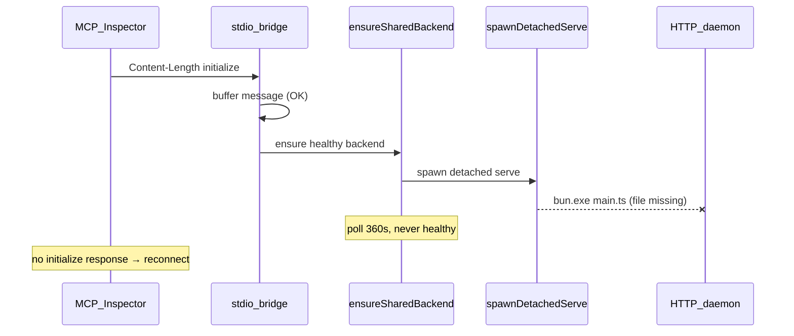

# Fix openadt-mcp shared backend cold-start (v1.3.16)

## 1. Initial user problem

After installing **openadt-mcp 1.3.16** via Scoop, connecting through **MCP Inspector** fails with a **reconnect loop**: the client repeatedly tries to connect, never completes the MCP handshake, and shows no tools.

Typical MCP config (from [docs/usage.md](docs/usage.md) on `origin/main`):

```json
{
  "mcpServers": {
    "sap-adt": {
      "command": "openadt-mcp",
      "args": ["serve", "--stdio"]
    }
  }
}
```

This is the **recommended** install path and the **default shared stdio mode** introduced in PR #67/#68 (merged as part of the 1.3.14–1.3.16 release line).

---

## 2. Why it looks like an initialization bug (but is not the same one)

You correctly remembered a prior initialize-related fix from **2026-06-05** (`[.agents/memory/observations/2026-06-05-mcp-agent-stdio-fix.md](.agents/memory/observations/2026-06-05-mcp-agent-stdio-fix.md)`):

| Prior fix (still valid)                                                                                 | What it solved                                                    |
| ------------------------------------------------------------------------------------------------------- | ----------------------------------------------------------------- |
| Start stdin reader **immediately** in `[stdio-proxy.ts](tools/sap-adt-mcp-launcher/src/stdio-proxy.ts)` | Buffer `initialize` while SAP logon runs                          |
| Dual transport in `[mcp-framing.ts](tools/sap-adt-mcp-launcher/src/mcp-framing.ts)`                     | Content-Length (IDE / MCP Inspector) vs NDJSON (Cursor agent CLI) |
| `flush()` before exit                                                                                   | Avoid truncated stdout responses                                  |

Those fixes are **working** in 1.3.16. MCP Inspector sends **Content-Length** frames; the bridge **does** read and queue `initialize`.

The **new** failure is one layer earlier: in shared mode the bridge never reaches `bridge.run()` because the **detached HTTP daemon never starts**, so queued `initialize` is never forwarded.



---

## 3. Root cause (v1.3.16 regression)

**Feature:** Shared backend (`[specs/mcp-shared-backend.md](specs/mcp-shared-backend.md)`) — `serve --stdio` (default) calls `ensureSharedBackend()` in `[main.ts](tools/sap-adt-mcp-launcher/src/main.ts)` (`cmdServeSharedStdio`), which spawns a detached HTTP daemon when no healthy endpoint exists.

**Bug:** `[ensure-backend.ts](tools/sap-adt-mcp-launcher/src/ensure-backend.ts)` `spawnDetachedServeInternal` always does:

```typescript
spawn(resolveBunExecutable(), [launcher, "serve", "--port", port, "--foreground", ...], {
  stdio: "ignore",  // spawn errors are invisible
  detached: true,
});
```

where `launcher = resolveDefaultLauncherPath()` resolves to `dist/main.mjs` → `dist/main.js` → `main.ts` relative to embedded bundle `here`.

For the **Scoop-installed compiled binary** (`openadt-mcp.exe`, ~115 MB, no sibling `dist/` or `main.ts` on disk):

- `resolveDefaultLauncherPath()` falls through to a **non-existent** `main.ts` path
- `bun.exe` fails immediately (or tries to parse the `.exe` as JS if mis-resolved)
- Daemon never writes to `~/.openadt/mcp/endpoints/`
- `ensureSharedBackend` polls up to **360s**; bridge stays in "not ready"
- **No stdout response** to `initialize` → MCP Inspector timeout → reconnect loop

**Evidence from local reproduction (your machine, 1.3.16):**

| Scenario                                             | Result                                                                         |
| ---------------------------------------------------- | ------------------------------------------------------------------------------ |
| `openadt-mcp serve --stdio` (cold start)             | 60–120s, no `initialize` response; stderr only: `stdio: reading client input…` |
| `openadt-mcp serve --stdio --standalone`             | `initialize` OK (~1s with `--import-from=none`)                                |
| `openadt-mcp serve` then `openadt-mcp serve --stdio` | attach to existing backend OK; `initialize` OK                                 |

**Why standalone works:** `[cmdServeStandalone](tools/sap-adt-mcp-launcher/src/main.ts)` runs the monolithic path — same process owns `adt-lsc` + HTTP MCP + stdio bridge; no detached spawn.

**Why attach works when daemon pre-started:** `ensureSharedBackend` step 1 finds healthy endpoint; spawn is skipped.

---

## 4. Affected vs unaffected paths

| Entry point                                      | Cold start shared    | Notes                                                                    |
| ------------------------------------------------ | -------------------- | ------------------------------------------------------------------------ |
| Scoop/Homebrew `openadt-mcp serve --stdio`       | **Broken**           | Primary user report                                                      |
| Dev clone `bun tools/.../main.ts serve --stdio`  | **Works**            | `main.ts` exists on disk                                                 |
| `openadt-mcp serve --stdio --standalone`         | **Works** (terminal) | Monolithic; Amazon Q may still fail (GUI PATH, logon timeout) — see §4.1 |
| `openadt-mcp bridge --stdio` with running daemon | **Works**            | Best Amazon Q workaround until 1.3.17                                    |
| Cursor repo dev `bun run mcp:stdio`              | **Works**            | Shared by default via `mcp-stdio-entry.ts`                               |
| Amazon Q + `"command": "openadt-mcp"` (shim)     | **Often broken**     | GUI apps lack Scoop PATH → use abs path to `.exe`                        |

### 4.1 False fix — removing `--standalone` “works” but tools degrade

Observed after dropping `--standalone`:

1. Shared `serve --stdio` **attach**es to an existing endpoint in `~/.openadt/mcp/endpoints/` (e.g. port 2236, `mode: "standalone"` from an earlier run).
2. `spawnDetachedServe` is **skipped** → `initialize` succeeds quickly (“server works”).
3. Side effects:
   - **No fresh SAP logon** — bridge does not re-run destination import / `ensureLoggedOn`.
   - **OpenADT read tools** missing — shared attach needs daemon `auxUrl`/`auxToken`; stdio-origin backends typically lack them → `read tools unavailable`.
   - **SAP `abap_*` tools** (~14) may still exist on HTTP backend but Amazon Q may show empty list after prior failed connects (cached / lost `Mcp-Session-Id`).

This **masks** the cold-start spawn bug; it is not a fix.

### 4.2 Amazon Q (Windows)

| Symptom                                         | Cause                        | Not SAP MCP bearer                               |
| ----------------------------------------------- | ---------------------------- | ------------------------------------------------ |
| `AccessDeniedException: bearer token … invalid` | Amazon Q / AWS login expired | Re-sign-in (Q Sign Out → Sign In; `q login`)     |
| MCP spawn ENOENT                                | Scoop shim not on GUI PATH   | Abs path to `openadt-mcp.exe`                    |
| Reconnect during logon                          | Client timeout before SSO    | Pre-start `openadt-mcp serve` + `bridge --stdio` |

Config: `%USERPROFILE%\.aws\amazonq\mcp.json`.

### 4.3 Two tool families

| Tools                  | `--standalone` stdio | Shared attach                 |
| ---------------------- | -------------------- | ----------------------------- |
| SAP ADT `abap_*` (~14) | ✅                   | ✅ if backend healthy         |
| OpenADT read/search    | ✅ in-process LSP    | ❌ unless daemon has `auxUrl` |

---

## 5. Immediate workaround (no code)

**Do not** rely on “remove `--standalone`” — that only attaches to a stale backend.

**Amazon Q (until 1.3.17):** terminal `openadt-mcp serve --restart`, then mcp.json `"args": ["bridge", "--stdio"]` with abs `.exe` path.

**Full tool set (SAP + read):** `"args": ["serve", "--stdio", "--standalone"]` + abs path.

**Clean slate:**

```powershell
Stop-Process -Name openadt-mcp, adt-lsc -Force -ErrorAction SilentlyContinue
Remove-Item "$env:USERPROFILE\.openadt\mcp\endpoints\*" -Force -ErrorAction SilentlyContinue
Remove-Item "$env:USERPROFILE\.openadt\mcp\ensure-*.lock" -Force -ErrorAction SilentlyContinue
```

---

## 6. Implementation plan

**Branch base:** `origin/main`. **Order:** specs (6.1) → code (6.2) → tests (6.3) → docs (6.5) → release (8). Docs are **in scope for the implementation PR**, not a separate follow-up.

### 6.1 Spec update (SDD gate)

Edit `[specs/mcp-shared-backend.md](specs/mcp-shared-backend.md)` § **Daemon spawn** to document launcher resolution:

- **Dev / dist:** `bun <path-to-main.{ts,mjs,js}> serve --port … --foreground …`
- **Packaged standalone binary (`openadt-mcp.exe`):** `process.execPath serve --port … --foreground …` (re-exec self; no Bun script path)
- Optional test override: `OPENADT_MCP_LAUNCHER` env var (for unit tests)

Mirror one sentence in `[specs/mcp.md](specs/mcp.md)` shared-mode section if it references daemon spawn.

### 6.2 Code fix

**File:** `[tools/sap-adt-mcp-launcher/src/ensure-backend.ts](tools/sap-adt-mcp-launcher/src/ensure-backend.ts)`

Extract and export a small resolver (testable):

```typescript
export function resolveDetachedSpawn(launcherPath?: string): {
  command: string;
  args: string[]; // full argv after command, starting with "serve"
};
```

**Resolution order** (implemented as `resolveDetachedSpawn(launcherPath?, { compiled? })`):

1. If `launcherPath` provided (tests / `OPENADT_MCP_LAUNCHER`):
   - `.ts` / `.mjs` / `.js` → `bun` + script path + serve args
   - else → treat as executable, serve args only
2. Else if `Bun.isCompiled === true` (or the test seam `options.compiled === true`) → **`process.execPath`** + serve args only (packaged binary path; checked **before** disk probes so a stray cwd `dist/` or `src/main.ts` cannot trick the binary into invoking a missing `bun`).
3. Else if `dist/main.mjs` or `dist/main.js` exists → `bun` + dist entry
4. Else if `src/main.ts` (or `here/main.ts`) exists → `bun` + main.ts (dev clone)
5. Else → `process.execPath` + serve args only (packaged binary without on-disk scripts — same as #2)

Refactor `spawnDetachedServeInternal` to use this resolver instead of hard-coded `resolveBunExecutable()` + script path.

**Optional UX hardening (small, recommended):**

- Log to stderr once when spawning: `[openadt-mcp] Spawning shared MCP daemon on port …` (include resolved `command` + first arg for support)
- On `OPENADT_MCP_TIMEOUT`, include hint: `daemon spawn may have failed (check openadt-mcp is on PATH / reinstall)`
- On shared **attach** (not spawn), log: `Attached to existing backend (port …, mode …, started …)` so users know they are not on a fresh daemon

Do **not** change shared vs standalone default in this PR; fix spawn only.

**Out of scope (follow-up PR):**

- Shared attach to stdio-origin backends without `auxUrl` — read tools gap
- Forward `--destination` / `--import-from` on attach when user explicitly passes them
- Amazon Q–specific installer hint in Scoop post-install (abs path snippet)

### 6.3 Unit tests

**File:** `[tools/sap-adt-mcp-launcher/src/ensure-backend.test.ts](tools/sap-adt-mcp-launcher/src/ensure-backend.test.ts)`

Add tests for `resolveDetachedSpawn`:

| Case                                          | Expected `command` | Expected args prefix         |
| --------------------------------------------- | ------------------ | ---------------------------- |
| Explicit `.ts` launcher path                  | `bun` (or mock)    | `[launcherPath, "serve", …]` |
| Explicit `.exe` launcher path                 | that exe           | `["serve", …]`               |
| Packaged mode (mock: no dist/main.ts on disk) | `process.execPath` | `["serve", "--port", …]`     |
| Dev mode (temp dir with fake `main.ts`)       | `bun`              | `[main.ts, "serve", …]`      |

Use temp dirs / env overrides; avoid actually spawning SAP.

### 6.4 No packaging changes required

Scoop/Homebrew ship a single `openadt-mcp.exe`; fix is entirely in runtime spawn logic. Release as **v1.3.17** (or next patch).

### 6.5 Documentation (same PR — SDD gate after specs, with code)

User-facing and packaging docs ship **together** with the spawn fix, not in a follow-up.

#### [docs/usage.md](docs/usage.md)

Add subsection **MCP troubleshooting** (after “Checking status”, before general Troubleshooting table, or extend existing `#troubleshooting`):

| Symptom                                                         | Cause                                                         | Action                                                                                      |
| --------------------------------------------------------------- | ------------------------------------------------------------- | ------------------------------------------------------------------------------------------- |
| MCP client reconnect loop (Inspector, Cursor) on cold start     | Shared mode cannot spawn daemon from compiled `.exe` (1.3.16) | Upgrade to 1.3.17+; interim `serve --restart` + `bridge --stdio`                            |
| Server connects but tools missing after removing `--standalone` | Attach to **stale** endpoint in `~/.openadt/mcp/endpoints/`   | `openadt-mcp stop`; clear endpoints; `--restart` or `--standalone`                          |
| Only SAP `abap_*` tools, no read/search tools                   | Shared attach; daemon lacks `auxUrl`                          | Use `--standalone` for read tools, or restart daemon via `serve` (not stdio-origin backend) |
| Amazon Q spawn ENOENT                                           | GUI PATH lacks Scoop shim                                     | Abs path: `…\scoop\apps\openadt-mcp\current\openadt-mcp.exe`                                |
| `AccessDeniedException: bearer token … invalid`                 | **Amazon Q / AWS** session expired                            | Q Sign Out → Sign In; not SAP MCP Bearer                                                    |
| Hang before first tool list                                     | SAP logon / SSO in progress (up to minutes)                   | Approve SSO; do not reconnect; or pre-start `openadt-mcp serve`                             |

Add **Amazon Q** under “Configuring your agent”:

- Config file: `%USERPROFILE%\.aws\amazonq\mcp.json` (workspace: `.amazonq/mcp.json`)
- Recommended pattern until cold-start shared is fixed: terminal `openadt-mcp serve --restart`, agent `bridge --stdio`
- Example JSON with Windows abs `.exe` path (placeholder `<user>`)

Clarify in **Shared backend** section:

- Default `serve --stdio` is shared; `--standalone` owns lifecycle + OpenADT read tools in-process
- Do **not** document “remove `--standalone`” as a fix

Update **Standalone `openadt-mcp` install** example: note that `command: "openadt-mcp"` works in terminal; GUI agents may need abs path.

#### [specs/mcp-shared-backend.md](specs/mcp-shared-backend.md)

§ **Daemon spawn** — replace pseudocode with resolution table (dev bun+script vs packaged `process.execPath`); link to `resolveDetachedSpawn`.

Add § **Stale attach** — attach reuses healthy endpoint; does not re-logon or add read tools without `auxUrl`.

#### [specs/mcp.md](specs/mcp.md)

One paragraph under agent config / shared mode: packaged binary spawn rule + pointer to usage troubleshooting.

#### [README.md](README.md)

MCP section: one line — shared stdio default; link to usage MCP troubleshooting for Inspector / Amazon Q.

#### [packaging/scoop/openadt-mcp-post-install.ps1](packaging/scoop/openadt-mcp-post-install.ps1)

Post-install “Next steps”: print example abs path for `%USERPROFILE%\.aws\amazonq\mcp.json` and `serve` + `bridge --stdio` pattern (no code change to manifest).

#### [tools/sap-adt-mcp-launcher/README.md](tools/sap-adt-mcp-launcher/README.md)

Modes table: footnote on shared attach vs standalone read tools.

**Verify after doc edits:** `bun scripts/verify-spec-sync.ts`, `bun scripts/verify-package-docs.ts`.

---

## 7. Testing plan

### 7.1 Automated (CI / pre-PR)

From repo root ([AGENTS.md](AGENTS.md) verify block):

```bash
cd tools/sap-adt-mcp-launcher && bun test ensure-backend.test.ts
bunx eslint scripts/ .agents/skills/ --max-warnings 0
bun scripts/verify-spec-sync.ts
```

Full launcher suite: `cd tools/sap-adt-mcp-launcher && bun test`

### 7.2 Manual — packaged binary (regression target)

Build or install fixed binary, then:

**Test A — cold start shared (must pass after fix):**

```powershell
# Clean state
Stop-Process -Name openadt-mcp -Force -ErrorAction SilentlyContinue
Remove-Item "$env:USERPROFILE\.openadt\mcp\endpoints\*" -Force -ErrorAction SilentlyContinue
Remove-Item "$env:USERPROFILE\.openadt\mcp\ensure-*.lock" -Force -ErrorAction SilentlyContinue

# Content-Length client (MCP Inspector transport)
bun run test:mcp:stdio   # point script at openadt-mcp.exe instead of bun main.ts
# OR MCP Inspector with args: ["serve", "--stdio"]
```

**Pass criteria:**

- stderr shows `Attached to shared backend at http://localhost:…/mcp` within SAP logon budget
- `initialize` returns `serverInfo.name: "ADT MCP Server"`
- `tools/list` returns SAP tools
- `openadt-mcp list` shows one endpoint; second `serve --stdio` attaches without new `adt-lsc`

**Test B — standalone still works:** `serve --stdio --standalone` unchanged.

**Test C — attach-only:** `openadt-mcp serve` in background → `openadt-mcp serve --stdio` attaches.

**Test D — dev clone unchanged:** `bun tools/sap-adt-mcp-launcher/src/main.ts serve --stdio` cold start.

### 7.3 MCP Inspector checklist

1. Config: `command: openadt-mcp`, `args: ["serve", "--stdio"]` (no `--standalone` after fix)
2. Connect → single connection, no reconnect loop
3. `initialize` + `tools/list` succeed
4. Disconnect/reconnect → attaches to existing shared backend (faster second connect)

### 7.4 Amazon Q checklist

1. Abs path to `openadt-mcp.exe` in `%USERPROFILE%\.aws\amazonq\mcp.json`
2. Cold start `serve --stdio` (after fix) → 14 `abap_*` tools visible
3. `tools/call` on `abap_list_destinations` succeeds
4. AWS `AccessDeniedException` = Q login, not SAP MCP token

### 7.5 Stale-attach regression

After clean store, cold `serve --stdio` must create **new** `endpoints/<port>.json` with `mode: "daemon"` (not reuse old standalone record without user intent).

---

## 8. Release

- Cut **v1.3.17** with fixed `openadt-mcp` artifacts + doc updates from §6.5
- Scoop bucket sync (existing release workflow)
- Release note bullets:
  - Fix shared stdio cold-start from compiled `openadt-mcp.exe`
  - MCP troubleshooting in [docs/usage.md](docs/usage.md) (Amazon Q, stale attach, tool families)

---

## 9. Summary

| Layer                                           | Status in 1.3.16                               |
| ----------------------------------------------- | ---------------------------------------------- |
| Initialize buffering + Content-Length framing   | OK                                             |
| Shared backend attach (daemon already running)  | OK — masks spawn bug; read tools often missing |
| Shared backend **cold-start spawn from `.exe`** | **Broken** — root cause of reconnect loop      |
| `--standalone` in Amazon Q                      | Partial — PATH / logon timeouts                |
| SAP `abap_*` on healthy backend                 | OK (14 tools verified on :2236)                |
| OpenADT read tools on shared attach             | Often **missing** (no `auxUrl`)                |

The fix is a targeted change to detached daemon spawn resolution in `[ensure-backend.ts](tools/sap-adt-mcp-launcher/src/ensure-backend.ts)`, plus spec + unit tests, verified against packaged binary, MCP Inspector, and Amazon Q cold-start paths.
