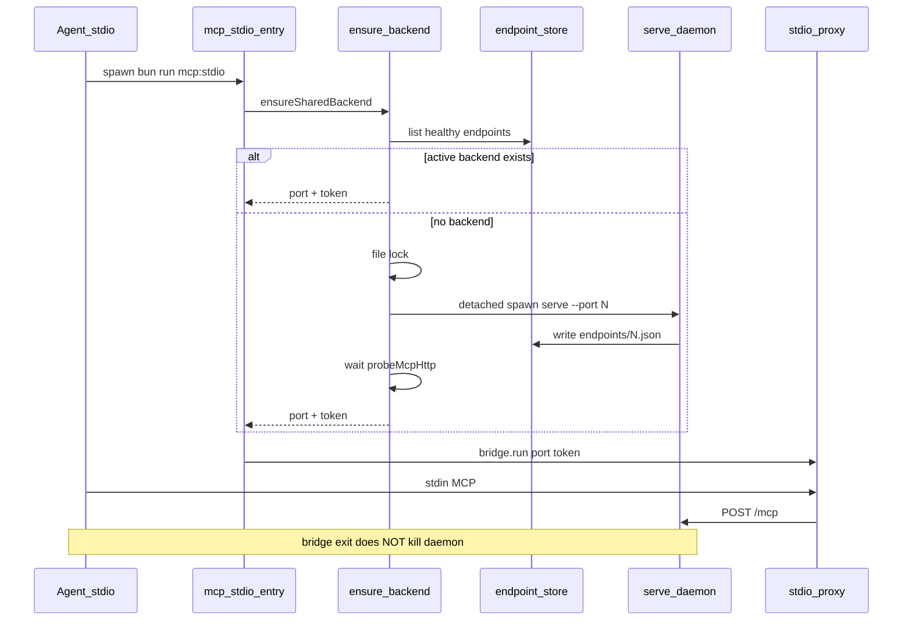

# MCP shared backend — auto ensure + attach (English)

## Problem

Each `serve --stdio` / `bun run mcp:stdio` spawns a full stack (`adt-lsc` + HTTP MCP + stdio bridge):

- Direct `openadt mcp serve --stdio` uses default port **2236** and calls `[stopTrackedMcpServers](tools/sap-adt-mcp-launcher/src/main.ts)` on that port — killing prior instances.
- Agent entry `[mcp-stdio-entry.ts](tools/sap-adt-mcp-launcher/src/mcp-stdio-entry.ts)` picks an **ephemeral** port per spawn — avoids same-port kill but still spawns a new `adt-lsc` per agent (shared Eclipse workspace `~/.openadt/adt-ls-workspace` cannot run in parallel).
- Bridge exit runs `shutdown()` — kills HTTP MCP and `adt-lsc`.

**Goal:** zero manual terminal; OpenADT checks for a healthy backend, starts a detached daemon if missing, otherwise attaches a lightweight stdio bridge. Multiple agents share one `adt-lsc` + one HTTP endpoint.

## Target architecture



## Plan storage convention

- **All plans in English** (this file and future CreatePlan output).
- After approval, copy this plan to **[docs/plans/2026-06-07-mcp-shared-backend.md](docs/plans/2026-06-07-mcp-shared-backend.md)** (tracked in git).
- Update **[.agents/backlog/2026-06-07-mcp-shared-backend.md](.agents/backlog/2026-06-07-mcp-shared-backend.md)** to mirror the 9 todos below 1:1; `source:` points to the docs/plans file.

---

## SDD: new spec file

Create **[specs/mcp-shared-backend.md](specs/mcp-shared-backend.md)** — contract for ensure/attach/daemon lifecycle. Cross-link [specs/mcp.md](specs/mcp.md) for SAP interface; do not duplicate LSP/HTTP MCP details.

### Required spec sections

| Section                    | Content                                                                                                                                                                        |
| -------------------------- | ------------------------------------------------------------------------------------------------------------------------------------------------------------------------------ |
| **Scope**                  | Multi-agent stdio; no manual `mcp serve`; one `adt-lsc` per workspace                                                                                                          |
| **Modes**                  | `shared` (default for agent entry) vs `standalone` (`serve --stdio --standalone`, legacy monolithic)                                                                           |
| **Ensure algorithm**       | (1) healthy endpoint in store → attach; (2) else lock → double-check → spawn daemon → poll; (3) bridge-only exit                                                               |
| **Healthy endpoint**       | `readEndpoint(port)` + `isProcessAlive(pid)` + `probeMcpHttp(port, token)`                                                                                                     |
| **Port selection**         | Default `2236`; override `--port` / `OPENADT_MCP_PORT`; **auto-increment** if port busy (TCP bind fail or `startMCPServer` port-in-use) — try N+1 up to 65535, max 32 attempts |
| **Attach resolution**      | Exactly one healthy endpoint in store → attach (ignore preferred port). More than one → exit `5` + message `mcp list`                                                          |
| **Daemon spawn**           | `serve` without `--stdio`; `detached: true`, `stdio: ignore`, `unref()`; not a child of the bridge process                                                                     |
| **Lock**                   | `~/.openadt/mcp/ensure-<port>.lock` (exclusive create); waiter polls endpoint every 500ms; timeout 360s (SAP logon)                                                            |
| **Bridge shutdown**        | stdin close / SIGTERM → exit bridge only; do **not** call `stopMcpServer` or kill `adt-lsc`                                                                                    |
| **Backend shutdown (MVP)** | `openadt mcp stop [--port]` only; idle timeout deferred to spec §Future                                                                                                        |
| **Cold-start race**        | Lock + double-check after acquire                                                                                                                                              |
| **Failure modes**          | Table: extension missing, logon timeout, lock timeout, ambiguous endpoints, spawn failed — with exit codes                                                                     |
| **Agent config**           | `.cursor/mcp.json` unchanged (`bun run mcp:stdio`); entry switches to shared mode                                                                                              |
| **Security**               | Token in endpoint store mode `0600`; redact Bearer in logs                                                                                                                     |

### Index updates (same PR)

- [DESIGN.md](DESIGN.md) — spec index row
- [specs/README.md](specs/README.md) — new row
- [AGENTS.md](AGENTS.md) — area row → `specs/mcp-shared-backend.md`
- [specs/mcp.md](specs/mcp.md) — Agent config: shared default + link; `--standalone` for CI; soften "stale servers stopped" for shared bridge path
- [specs/cli.md](specs/cli.md) — new flags, subcommands, exit codes

---

## CLI surface

| Command / flag                   | Behavior                                                                   |
| -------------------------------- | -------------------------------------------------------------------------- |
| `mcp serve --stdio`              | **Shared** (ensure + bridge) — **new default**                             |
| `mcp serve --stdio --standalone` | Current monolithic path (owns `adt-lsc`, kills on exit)                    |
| `mcp serve`                      | HTTP-only daemon (unchanged; used as detached child)                       |
| `mcp stop [--port]`              | `stopTrackedMcpServers({ onlyPort })`; exit `0` if stopped or already dead |
| `mcp bridge --stdio [--port]`    | Attach-only; fail if no healthy backend (tests / low-level)                |

**New exit codes** (document in [specs/cli.md](specs/cli.md)):

- `5` — multiple active endpoints (ambiguous)
- `6` — ensure lock timeout
- `7` — daemon spawn failed

---

## Implementation

### 1. `ensure-backend.ts` (new)

Path: [tools/sap-adt-mcp-launcher/src/ensure-backend.ts](tools/sap-adt-mcp-launcher/src/ensure-backend.ts)

- `findHealthyEndpoints(): McpEndpointRecord[]`
- `resolveAttachTarget(preferredPort?: number): ResolveResult`
- `findAvailablePort(start: number): Promise<number>` — sequential TCP bind from start (pattern from [mcp-stdio-entry.ts](tools/sap-adt-mcp-launcher/src/mcp-stdio-entry.ts))
- `withEnsureLock(port, fn)` — exclusive lock file + cleanup
- `spawnDetachedServe(port, serveArgs)` — spawn [main.ts](tools/sap-adt-mcp-launcher/src/main.ts) `serve` without stdio
- `ensureSharedBackend(options): Promise<{ port, token, url }>`

### 2. Refactor `main.ts`

- Extract `cmdServeStandalone` from current `cmdServe` (`stopTrackedMcpServers` + shutdown on exit)
- Add `cmdServeSharedStdio` — `ensureSharedBackend` → bridge → **no backend shutdown**
- Add `cmdBridge` — attach-only (no ensure spawn)
- Add `cmdStop` — wrap `stopTrackedMcpServers`
- Route: `serve --stdio` → shared unless `--standalone`

### 3. Entry point

[tools/sap-adt-mcp-launcher/src/mcp-stdio-entry.ts](tools/sap-adt-mcp-launcher/src/mcp-stdio-entry.ts):

- Remove ephemeral port as default for agent path
- Pass `--port` only when `OPENADT_MCP_PORT` is set
- Invoke shared `serve --stdio`; keep runtime env merge

### 4. Endpoint store

[tools/sap-adt-mcp-launcher/src/endpoint-store.ts](tools/sap-adt-mcp-launcher/src/endpoint-store.ts):

- `findHealthyEndpoint(port?: number)` — record + probe
- Optional `mode: "daemon" | "standalone"` on record (backward compatible)

### 5. Config parsing

[tools/sap-adt-mcp-launcher/src/config.ts](tools/sap-adt-mcp-launcher/src/config.ts):

- `standalone: boolean` flag on serve
- Subcommands `bridge`, `stop`

### 6. Java CLI

- [McpServeCommand.java](apps/openadt-cli/src/main/java/org/openadt/cli/McpServeCommand.java) — forward `--standalone`
- New [McpStopCommand.java](apps/openadt-cli/src/main/java/org/openadt/cli/McpStopCommand.java)
- [McpCommand.java](apps/openadt-cli/src/main/java/org/openadt/cli/McpCommand.java) — register `stop`
- [McpCommandSupport.java](apps/openadt-cli/src/main/java/org/openadt/cli/McpCommandSupport.java) — args builder

---

## Tests (TDD)

| File                                                                  | Cases                                                                                                       |
| --------------------------------------------------------------------- | ----------------------------------------------------------------------------------------------------------- |
| `ensure-backend.test.ts`                                              | lock exclusivity; double-check after lock; port increment; single healthy attach; error on multiple healthy |
| `endpoint-store.test.ts`                                              | `findHealthyEndpoint` with mocked probe                                                                     |
| `main.test.ts` (or integration)                                       | shared bridge exit does not call backend shutdown                                                           |
| `config.test.ts`                                                      | `--standalone`, `bridge`, `stop` argv                                                                       |
| [test-mcp-stdio.ts](tools/sap-adt-mcp-launcher/src/test-mcp-stdio.ts) | add `--standalone` for existing smoke                                                                       |

Mock `spawn` / `probeMcpHttp` in unit tests; no SAP in CI.

---

## Docs

- [docs/usage.md](docs/usage.md) — MCP section: shared backend + `mcp stop`
- [tools/sap-adt-mcp-launcher/README.md](tools/sap-adt-mcp-launcher/README.md) — modes table

No README.md product rewrite unless requested.

---

## Verify (before PR)

```bash
bun scripts/verify-spec-sync.ts
bun scripts/verify-package-docs.ts
cd tools/sap-adt-mcp-launcher && bun test
./mvnw -q verify -Pdistribution
bun run openadt:test
```

**Manual smoke:** two parallel `agent mcp list-tools sap-adt` — second does not kill first; `openadt mcp list` shows one daemon; `openadt mcp stop` stops backend.

---

## Breaking change

`openadt mcp serve --stdio` semantics change to shared. CI/scripts expecting owned lifecycle use `--standalone`. Agent entry (`mcp:stdio`) gets shared mode without changing `.cursor/mcp.json`.

## Out of scope (MVP)

- Idle auto-shutdown of backend
- HTTP `url` in `.cursor/mcp.json` (document as optional alternative in mcp.md)
- Bridge process refcount
- `--attach` alias (use `bridge` + ensure)
