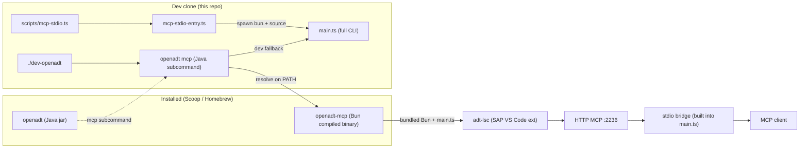

# Plan: implement PR #70 — `openadt-mcp` as a separate product

## Goal

Ship `openadt-mcp` as a **separate, installable** compiled Bun binary in the `abapify/openadt` monorepo, alongside the existing `openadt` Java product. Both installable via Scoop / Homebrew. The Java `openadt mcp` subcommand stays and **wraps** the new `openadt-mcp` binary (no deprecation, no removal).

Implements the three sub-PRs from `.cursor/plans/openadt-mcp_monorepo_product_31ab8085.plan.md` as **one** branch / one verify pass.

## User decisions (locked in this plan)

| Decision                                                           | Choice                                                                                       | Rationale                                                                                                                                                                                          |
| ------------------------------------------------------------------ | -------------------------------------------------------------------------------------------- | -------------------------------------------------------------------------------------------------------------------------------------------------------------------------------------------------- |
| Folder rename `tools/sap-adt-mcp-launcher/` → `tools/openadt-mcp/` | **No**                                                                                       | Avoid unnecessary diff. Plan marks it out of scope for Phase 1.                                                                                                                                    |
| Matrix targets                                                     | `win-x64`, `linux-x64`, `darwin-arm64`, `darwin-x64`                                         | `openadt` and `openadt-mcp` both built on all 4 in v1.                                                                                                                                             |
| `openadt mcp` Java wrapper behavior                                | **Stays, wraps `openadt-mcp`**                                                               | Resolve `openadt-mcp` on PATH → spawn directly (no JVM hop, no bun). Fallback for dev clone: `bun + tools/sap-adt-mcp-launcher/src/main.ts` (current behavior). Else: stderr error + install hint. |
| Both installable side-by-side                                      | Yes                                                                                          | User explicitly required.                                                                                                                                                                          |
| End goal                                                           | `scoop install openadt` and `scoop install openadt-mcp` work independently; same for `brew`. | Both products installable side-by-side on each platform.                                                                                                                                           |

## SDD gate (mandatory)

`DESIGN.md` + per-area spec updates **before** code. TDD for the bugfix and the build script.

1. **Specs** — `specs/mcp.md`, `specs/cli.md`, `specs/packaging.md`, `specs/vision.md` (this PR)
2. **Test** — failing test for `config.ts#flagValue.matches` (already broken for `--import-from=adtls`); new test for `build-openadt-mcp-release.ts` argv parsing (TS)
3. **Code** — new `openadt-mcp-bin.ts`; flagValue fix; `build-openadt-mcp-release.ts`; McpLauncherInvoker resolve change; `package-release` split; Scoop/Homebrew stubs; `release-version` bumps both; `release.yml` matrix
4. **No new Java packages** — `McpLauncherInvoker` extends in place; `verify-package-docs.ts` is unchanged
5. **Docs** — `docs/usage.md` MCP section adds `scoop install openadt-mcp` example; `specs/README.md` index updated
6. **Verify block** — must pass:
   - `bun scripts/verify-spec-sync.ts`
   - `bun scripts/verify-package-docs.ts`
   - `./mvnw -q verify -Pdistribution`
   - `bun run openadt:test` (Java tests)
   - `bun test tools/sap-adt-mcp-launcher` (launcher unit tests, including the flagValue fix)
   - `bunx eslint scripts/ .agents/skills/ --max-warnings 0` (strict gate, 0 errors / 0 warnings)

## Architecture (target)



## Phase A — Specs (before code)

### A1. `specs/mcp.md`

- Add a top-level **Product: `openadt-mcp`** section that documents:
  - Standalone CLI: `openadt-mcp <subcommand> [args]` — same subcommand surface as `openadt mcp` (no `openadt` prefix; the binary name already says it).
  - Published install: compiled Bun binary, **Bun NOT required at runtime**.
  - In-repo dev paths unchanged: `bun run mcp:stdio`, `./dev-openadt mcp`, `openadt-mcp-dev` shim.
  - Endpoint store: `~/.openadt/mcp/endpoints/<port>.json` (unchanged).
  - Phase-4 step "Scoop invokes `openadt mcp`" → replaced with `scoop install openadt-mcp` (independent of `openadt`).
- Update **Implementation plan** § Phase 4 to "Remove `sap-adt-mcp-launcher/` from `openadt.zip`; new `openadt-mcp-{platform}.{zip|tar.gz}` artifact per release."

### A2. `specs/cli.md`

- **`openadt mcp`** section: keep the subcommand, add a paragraph saying the Java wrapper **resolves and spawns** the standalone `openadt-mcp` binary (no Bun hop, no bundled launcher). Add "Resolution order": (1) `openadt-mcp` on PATH, (2) dev clone via `OPENADT_REPO` + bun, (3) error + install hint.
- New **Standalone `openadt-mcp` CLI** section with the same subcommand list and a one-liner that `openadt-mcp serve --stdio` is equivalent to the current `openadt mcp serve --stdio`.
- Cross-link `specs/packaging.md` and `specs/mcp.md`.

### A3. `specs/packaging.md`

- Two artifact families per release `vX.Y.Z`:
  - `openadt-X.Y.Z.zip` — **only** `openadt.jar` + `openadt.exe` (Windows) + `bin/` (PowerShell + bash launchers). **No `sap-adt-mcp-launcher/` folder.**
  - `openadt-mcp-X.Y.Z-{platform}.{zip|tar.gz}` for each matrix entry: `win-x64` (zip), `linux-x64` (tar.gz), `darwin-arm64` (tar.gz), `darwin-x64` (tar.gz). Contains the compiled binary, `LICENSE`, `README.md`.
- Scoop: new `packaging/scoop/openadt-mcp.json` (`bin: openadt-mcp.exe`); `packaging/scoop/openadt-mcp-post-install.ps1` (extension + Java hint).
- Homebrew: new `packaging/homebrew/openadt-mcp.rb` (depends on `openjdk@21` for `adt-lsc` only; **no** `depends_on "bun"`); `on_macos` / `on_linux` blocks for the right archive.
- `openadt` Scoop manifest cleanup: drop `Bun (for openadt mcp)` suggest; remove MCP from `notes`; remove the MCP post-install launcher check.
- `openadt` Homebrew formula: drop `libexec.install mcp_launcher` block.
- `release.yml` matrix table (build job): the build job fans out into 4 parallel matrix runs and produces both `openadt.zip` and `openadt-mcp-{platform}` artifacts.

### A4. `specs/vision.md`

- **Roadmap: MCP** section: redirect to `openadt-mcp` as a **separate installable**, with its own Scoop/Homebrew tap. The MVP table keeps `openadt fetch` / `openadt proxy`; the MCP row points to the new product and `specs/mcp.md`.

## Phase B — Tests (TDD, before code)

### B1. Fix the `flagValue.matches` bug + test

**`tools/sap-adt-mcp-launcher/src/config.ts:241-248`**

```ts
function flagValue(apply, forms): ServeArgvHandler {
  return {
    matches: (arg) => forms.some((form) => arg.startsWith(`${form}=`)),
    apply: ...
  };
}
```

Bug: a hand-coded handler for `--import-from` (config.ts:103-106) defines forms ending in `=gui` / `=openadt` / `=adtls` / `=auto`. When the user types `--import-from=adtls` it matches `--import-from=adtls=` (note the trailing `=` appended by the template), which never equals a real arg, so `parseServeArgv` throws "Unknown argument: --import-from=adtls" today. The fix is to make `flagValue` match a form that is a **prefix** of the arg, not a prefix-with-trailing-`=`:

```ts
matches: (arg) =>
  forms.some((form) => arg === form || arg.startsWith(`${form}=`));
```

**Failing test first** in `config.test.ts` (extends the existing `parseServeArgv` describe block):

```ts
test("--import-from=adtls sets importFrom=adtls (P0 bugfix)", () => {
  const cfg = parseServeArgv(["--import-from=adtls"]);
  expect(cfg.importFrom).toBe("adtls");
});

test("--import-from=openadt sets importFrom=openadt", () => {
  const cfg = parseServeArgv(["--import-from=openadt"]);
  expect(cfg.importFrom).toBe("openadt");
});

test("--import-from=auto sets importFrom=auto", () => {
  const cfg = parseServeArgv(["--import-from=auto"]);
  expect(cfg.importFrom).toBe("auto");
});
```

These three fail today; they pass after the one-line `matches` fix.

### B2. New `build-openadt-mcp-release.ts` argv parser test

`scripts/build-openadt-mcp-release.ts` (Phase C below) accepts `--platform=win-x64|linux-x64|darwin-arm64|darwin-x64` and `--out=dir`. Test the parser:

```ts
// tools/sap-adt-mcp-launcher/src/build-openadt-mcp-release.test.ts (new)
test("parsePlatform accepts the 4 matrix values", () => {
  for (const p of ["win-x64", "linux-x64", "darwin-arm64", "darwin-x64"]) {
    expect(parsePlatform(p)).toBe(p);
  }
});
test("parsePlatform rejects unknown values", () => {
  expect(() => parsePlatform("win32")).toThrow();
});
```

## Phase C — Code

### C1. New entry point: `openadt-mcp-bin.ts`

`tools/sap-adt-mcp-launcher/src/openadt-mcp-bin.ts` (new file, 9 LoC, mirrors `mcp-dev-stdio-bin.ts:9-18` but **without** the `serve --stdio` injection):

```ts
#!/usr/bin/env bun
/**
 * Compiled-Bun entry point for the published `openadt-mcp` CLI.
 * Compile: bun build --compile src/openadt-mcp-bin.ts --outfile openadt-mcp[.exe]
 *
 * Difference from mcp-dev-stdio-bin.ts: this is the full CLI (serve, list,
 * status, stop, bridge, print-config). The dev shim injects "serve --stdio"
 * for the MCP Inspector; the published binary does not.
 */
process.argv = [
  process.argv[0]!,
  process.argv[1] ?? "openadt-mcp",
  ...process.argv.slice(2),
];
await import("./main.ts");
export {};
```

Update `tools/sap-adt-mcp-launcher/package.json:5-7`:

```json
"bin": {
  "openadt-mcp": "./src/openadt-mcp-bin.ts"
}
```

Add `openadt-mcp-bin.ts` to `tools/sap-adt-mcp-launcher/tsdown.config.ts` `entry` array (so the existing `bun run build` step keeps producing working `dist/` for the dev path).

### C2. `flagValue` fix (B1)

Single edit at `tools/sap-adt-mcp-launcher/src/config.ts:242`. Verified by B1 tests.

### C3. New build script: `scripts/build-openadt-mcp-release.ts`

Compiles `tools/sap-adt-mcp-launcher/src/openadt-mcp-bin.ts` with `bun build --compile` for one platform at a time. Reads `--platform=` and `--out=`; reads `version` from `pom.xml` (same source as `package-release/src/main.ts:23-32`). Uses `Bun.build` API (no shell-out to bun) for cross-platform determinism. Output: `<out>/openadt-mcp[.exe]` plus a `LICENSE` and `README.md` from the launcher. LoC budget ≤ 150.

Why `Bun.build` API and not shell `bun build --compile`? The CI matrix runs on 4 different OS runners; each compiles **only its own platform**. The Bun CLI flag set is identical across OSes, so this is straightforward — no need for the JS API. The script uses the CLI to keep the build surface small and visible in CI logs.

```ts
#!/usr/bin/env bun
// scripts/build-openadt-mcp-release.ts
import {
  mkdirSync,
  cpSync,
  existsSync,
  readFileSync,
  statSync,
  writeFileSync,
} from "node:fs";
import { join, resolve } from "node:path";
import { spawnSync } from "node:child_process";

const root = resolve(import.meta.dir, "..");
const platformArg = process.argv
  .find((a) => a.startsWith("--platform="))
  ?.split("=")[1];
const outArg = process.argv.find((a) => a.startsWith("--out="))?.split("=")[1];
const platform = parsePlatform(platformArg); // throws on unknown
const outDir =
  outArg ??
  join(root, "packaging/dist", `openadt-mcp-${readVersion()}-${platform}`);

mkdirSync(outDir, { recursive: true });
const ext = platform.startsWith("win-") ? ".exe" : "";
const entry = join(root, "tools/sap-adt-mcp-launcher/src/openadt-mcp-bin.ts");
const outfile = join(outDir, `openadt-mcp${ext}`);

const r = spawnSync(
  "bun",
  ["build", "--compile", "--minify", entry, "--outfile", outfile],
  { stdio: "inherit" },
);
if (r.status !== 0) process.exit(r.status ?? 1);

cpSync(join(root, "LICENSE"), join(outDir, "LICENSE"));
cpSync(
  join(root, "tools/sap-adt-mcp-launcher/README.md"),
  join(outDir, "README.md"),
);
writeFileSync(join(outDir, "VERSION"), `${readVersion()}\n`);
console.log(`Built ${outfile} (${statSync(outfile).size} bytes)`);
```

Add Nx target in `tools/sap-adt-mcp-launcher/project.json`:

```json
"build:compile": {
  "executor": "nx:run-commands",
  "options": {
    "command": "bun scripts/build-openadt-mcp-release.ts",
    "forwardAllArgs": true
  }
}
```

Root `package.json`:

```json
"mcp:build:compile": "bun scripts/build-openadt-mcp-release.ts"
```

`parsePlatform` (CC ≤ 4, args ≤ 1): the 4-value Set lookup; no `if/else if` chain. Covered by B2 tests.

### C4. `tools/package-release/src/main.ts` — remove MCP from `openadt.zip`

Two surgical edits:

1. **Delete lines 181-203** (the `spawnSync("bun", ["run", "build"])` block + `cpSync(join(mcpLauncherSrc, "dist"), …)` + the `cpSync(join(mcpLauncherSrc, "package.json"), …)` + the `cpSync(join(mcpLauncherSrc, "README.md"), …)`). The `mcpLauncherDest` variable at lines 178-179 is no longer used; delete it. The `mcpLauncherSrc` const is no longer used; delete it.
2. After the openadt.zip is created (around line 224), call the new build script for the current runner's platform and emit the `openadt-mcp-{version}-{platform}.{zip|tar.gz}` archive (this still runs on `windows-latest` only — see C6 for the matrix move to 4 runners).

**CodeScene:** these are pure deletions. The post-deletion file is shorter, fewer exports/imports. Function CC stays ≤ 9 (most existing functions are 1-3).

### C5. New `tools/package-release/src/mcp-package.ts` (or inline in C4)

Stages the same `outDir` that C3 builds into, then zips/tar.gz's. Reuses `AdmZip` for `win-x64`, `tar` for the others (both already deps in root `package.json`).

### C6. `release.yml` matrix

`build` job becomes a **matrix of 4**:

```yaml
build:
  strategy:
    fail-fast: false
    matrix:
      include:
        - os: windows-latest, platform: win-x64,    ext: zip
        - os: ubuntu-latest,  platform: linux-x64,  ext: tar.gz
        - os: macos-latest,   platform: darwin-arm64, ext: tar.gz
        - os: macos-latest,   platform: darwin-x64,  ext: tar.gz
```

Per-runner steps:

1. checkout + bun install + setup-java (jdk 21)
2. **For windows-latest only**: build openadt.jar + run `package:release -- --version=${{ version }}` → produces `openadt-${{ version }}.zip` (which no longer contains the MCP folder)
3. **For every runner**: `bun run mcp:build:compile -- --platform=${{ matrix.platform }} --out=packaging/dist/openadt-mcp-${{ version }}-${{ matrix.platform }}` → produce the platform archive
4. upload-artifact with two patterns (openadt.zip only on windows; openadt-mcp-{platform} on every runner)

`create` job: downloads **all** artifacts, attaches them to a single release.

`sync` job: extend to patch both `openadt.json` and the new `openadt-mcp.json` (Scoop) plus `Formula/openadt.rb` and the new `Formula/openadt-mcp.rb` (Homebrew). New env var `mcp_sha256` is emitted by each matrix runner.

### C7. `McpLauncherInvoker.java` — new resolve order

`apps/openadt-cli/src/main/java/org/openadt/cli/McpLauncherInvoker.java:27-57` `invoke(...)`:

1. **`resolveOpenAdtMcpBinary()`** — walk `PATH` for `openadt-mcp` (Windows: `openadt-mcp.exe`; others: `openadt-mcp`). Use Java 11+ `FileSystems.getDefault().getPathMatcher` to handle the extension difference, or split `System.getenv("PATH")` by `File.pathSeparator` and check existence. Honor `OPENADT_MCP` env override. **This is the production fast path — no JVM hop, no bun.**
2. **Fallback** — `resolveLauncherMain()` (existing logic, dev clone via `OPENADT_REPO` or cwd walk → bun + source).
3. **Else** — print stderr: `openadt-mcp is not installed. Install with: scoop install openadt-mcp  (or)  brew install openadt-mcp`. Return exit 1.

CodeScene budget: existing `McpLauncherInvoker` is 166 LoC, LoC ≤ 70 per function. The new `resolveOpenAdtMcpBinary` is ≤ 30 LoC (PATH split + `Files.isRegularFile` check). No extract-method needed.

### C8. `tools/sync-scoop-bucket/sync.sh` and `tools/sync-homebrew-tap/sync.sh`

Parameterize on a **product** name. New function `sync_manifest <product> <path> <token>` accepts `openadt` or `openadt-mcp`; both call the same `push_manifest_via_gh_contents` / `push_manifest_to_repo` with the right relative path under the tap (`openadt.json` vs `openadt-mcp.json`; `Formula/openadt.rb` vs `Formula/openadt-mcp.rb`).

The bucket/tap env vars already exist (`OPENADT_SCOOP_BUCKET_REPO`, `OPENADT_HOMEBREW_TAP_REPO`); no new ones needed. The Contents-API path computes the target filename from the product, so the same script handles both.

### C9. `tools/release-version/src/main.ts` — bump both

Add two calls to `updateScoopMcp()` and `updateHomebrewMcp()` that mirror the existing `updateScoop()` (line 243) / `updateHomebrew()` (line 228) but operate on `packaging/scoop/openadt-mcp.json` and `packaging/homebrew/openadt-mcp.rb`. Both write `PLACEHOLDER_RUN_PACKAGE_RELEASE` for the hash (sync step fills the real one). No `Formula/openadt-mcp.rb` sync in this step (same reason `openadt` doesn't sync `Formula/openadt.rb` here — see the comment at `release-version/src/main.ts:237-240`).

### C10. New packaging stubs

`packaging/scoop/openadt-mcp.json` (mirror of `openadt.json` but `bin: openadt-mcp.exe`, `extract_dir: openadt-mcp-X.Y.Z`, no `Java` or `Bun` suggest — just `JDK 21` for `adt-lsc`).

`packaging/scoop/openadt-mcp-post-install.ps1`: SAP ADT VS Code extension presence check + JDK 21 check (no Bun).

`packaging/homebrew/openadt-mcp.rb`: `depends_on "openjdk@21"`; no `depends_on "bun"`. `on_macos` / `on_linux` blocks for the right archive URL. `bin.install "openadt-mcp"`.

`Formula/openadt-mcp.rb` (synced mirror, same way `Formula/openadt.rb` is — see `package-release/src/main.ts:148-152`).

### C11. `packaging/scoop/post-install.ps1` — drop MCP mentions

- Remove the `bun` check block (lines 19-25 of `post-install.ps1`).
- Remove the `sap-adt-mcp-launcher\src\main.ts` test (lines 27-30).
- Update the "Next steps" footer to mention `scoop install openadt-mcp` for MCP.
- Same for `packaging/homebrew/openadt.rb`: remove the `mcp_launcher` install block (lines 33-37).

### C12. `.cursor/mcp.json` and `docs/usage.md` — update for `openadt-mcp`

`.cursor/mcp.json` in-repo unchanged (still uses `bun run mcp:stdio` — dev path).

`docs/usage.md` MCP section: add a sub-section **"Standalone `openadt-mcp` install"** showing `scoop install openadt-mcp` and the resulting `.cursor/mcp.json`:

```json
{
  "mcpServers": {
    "sap-adt": {
      "command": "openadt-mcp",
      "args": ["serve", "--stdio"]
    }
  }
}
```

Mark the old "openadt mcp serve --stdio" snippets as **alternative** for users who only have the `openadt` package.

## Phase D — Verify block (gate)

Run all of these; all must pass:

```bash
# Spec sync (existing guard)
bun scripts/verify-spec-sync.ts

# Package docs (existing guard)
bun scripts/verify-package-docs.ts

# Strict ESLint on the hot path
bunx eslint scripts/ .agents/skills/ --max-warnings 0

# Java build + tests
./mvnw -q verify -Pdistribution

# Launcher unit tests (covers flagValue fix + build script parser)
bun test tools/sap-adt-mcp-launcher

# Smoke: bun build --compile works on the current host
bun run mcp:build:compile -- --platform=linux-x64 --out=/tmp/openadt-mcp-test
file /tmp/openadt-mcp-test/openadt-mcp   # expect: ELF 64-bit LSB executable
/tmp/openadt-mcp-test/openadt-mcp --help  # expect: usage banner from main.ts
```

## Files changed (final list)

**Specs (4 files, edits):**

- `specs/mcp.md` — new "Product: openadt-mcp" section; Phase 4 rewrite
- `specs/cli.md` — `openadt mcp` wrapper paragraph; new "Standalone openadt-mcp" section
- `specs/packaging.md` — two-artifact family; matrix table; new manifests
- `specs/vision.md` — MCP roadmap redirects to the new product

**Launcher / TS code (4 files, 1 new):**

- `tools/sap-adt-mcp-launcher/src/openadt-mcp-bin.ts` — **new** (9 LoC)
- `tools/sap-adt-mcp-launcher/src/config.ts` — flagValue.matches fix (1 line)
- `tools/sap-adt-mcp-launcher/src/config.test.ts` — 3 new tests
- `tools/sap-adt-mcp-launcher/src/build-openadt-mcp-release.test.ts` — **new** (2 tests, 25 LoC)
- `tools/sap-adt-mcp-launcher/package.json` — bin points to new entry
- `tools/sap-adt-mcp-launcher/tsdown.config.ts` — entry array adds openadt-mcp-bin.ts
- `tools/sap-adt-mcp-launcher/project.json` — `build:compile` nx target

**Build pipeline (4 files, 1 new):**

- `scripts/build-openadt-mcp-release.ts` — **new** (≤ 150 LoC)
- `tools/package-release/src/main.ts` — delete MCP copy block (~25 lines)
- `tools/release-version/src/main.ts` — add `updateScoopMcp` + `updateHomebrewMcp`
- `.github/workflows/release.yml` — matrix of 4; new sync steps

**Sync / packaging (4 new, 2 edits):**

- `packaging/scoop/openadt-mcp.json` — **new**
- `packaging/scoop/openadt-mcp-post-install.ps1` — **new**
- `packaging/scoop/post-install.ps1` — drop Bun / MCP launcher checks
- `packaging/homebrew/openadt-mcp.rb` — **new**
- `packaging/homebrew/openadt.rb` — drop mcp_launcher install block
- `Formula/openadt-mcp.rb` — **new** (synced mirror)
- `tools/sync-scoop-bucket/sync.sh` — product parameter
- `tools/sync-homebrew-tap/sync.sh` — product parameter

**Java / wrapper (1 edit):**

- `apps/openadt-cli/src/main/java/org/openadt/cli/McpLauncherInvoker.java` — new resolve order

**Root / docs (3 edits):**

- `package.json` — `mcp:build:compile` script
- `docs/usage.md` — "Standalone `openadt-mcp` install" section
- `docs/usage.md` — drop `Bun` install hint in Windows/MCP section

**Net diff:** ~10 new files, ~8 edits. 0 deletes via `git mv` (no renames). No new Java packages. LoC added ≤ 600. LoC removed ~30.

## Branch / PR strategy

- Branch: `feat/openadt-mcp-product` (already created by PR #70's planning commits on origin)
- Strategy: **one PR** containing all 3 sub-PR phases. Single verify pass. The user's request was "implement PR #70" — PR #70 is the plan-only PR, and the 3 sub-PRs are the implementation breakdown from the plan itself.
- Pushes: stop after 3 pushes (orchestrator rule from `openadt-orchestrator` self-instructions).

## Out of scope (explicit)

- Folder rename `tools/sap-adt-mcp-launcher/` → `tools/openadt-mcp/` (user said no).
- Removing `openadt mcp` from the Java CLI (the wrapper **stays**).
- Renaming the launcher product: package name stays `@openadt/sap-adt-mcp-launcher`; **published** name is `openadt-mcp`.
- Deprecation messaging, telemetry, analytics.
- Auto-update of the compiled binary.
- Linux arm64 / darwin-arm64 brew bottles (use plain `url` for both arches; Homebrew bottles are a follow-up).
