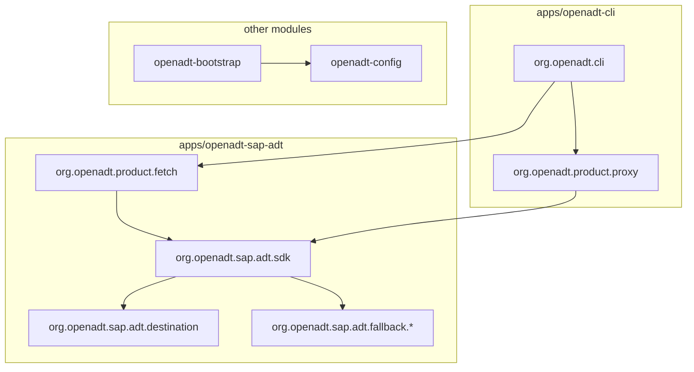

# OpenADT design — SDD enforcement

**This file is the enforced Spec-Driven Development (SDD) gate for the repo.** Agents and contributors must treat [`specs/`](specs/) as the source of truth for product behavior — not ad hoc code or chat summaries.

| Rule                                                                                    | Enforcement                                                 |
| --------------------------------------------------------------------------------------- | ----------------------------------------------------------- |
| Behavior change → update the matching `specs/*.md` **before or in the same PR** as code | Review + [openadt-sdd](.agents/skills/openadt-sdd/SKILL.md) |
| Detectors / CLI wiring match specs                                                      | `bun scripts/verify-spec-sync.ts` (CI)                      |
| No “undocumented” commands, flags, or config keys                                       | PR review; specs index below                                |

If a change is not described in `specs/`, it is **not done** for merge purposes until the spec is updated.

## Product (one paragraph)

OpenADT wraps the **official SAP ADT SDK** (`com.sap.adt.*`) so `openadt fetch` and `openadt proxy` use the same destination, session, and logon stack as Eclipse ADT. Fallback transports (`http`, `rest-rfc`) are explicit opt-in. Bootstrap only writes `~/.openadt/config.toml`; it is not the product surface.

North star detail: [specs/vision.md](specs/vision.md).

## Architecture



Module and package map: [apps/ARCHITECTURE.md](apps/ARCHITECTURE.md).

## Spec index

| Spec                                                 | Use when changing                                |
| ---------------------------------------------------- | ------------------------------------------------ |
| [vision.md](specs/vision.md)                         | Product scope, positioning                       |
| [cli.md](specs/cli.md)                               | Commands, flags, exit codes                      |
| [config.md](specs/config.md)                         | TOML schema, profiles, merge                     |
| [proxy.md](specs/proxy.md)                           | Local HTTP proxy, header redaction               |
| [setup.md](specs/setup.md)                           | Detectors, bootstrap output                      |
| [sdk-capabilities.md](specs/sdk-capabilities.md)     | SAP SDK APIs in use                              |
| [sdk-services.md](specs/sdk-services.md)             | Registered SDK services                          |
| [mcp.md](specs/mcp.md)                               | SAP ADT MCP launcher + official server interface |
| [adt-lsp-mcp-local.md](specs/adt-lsp-mcp-local.md)   | Local/global dev MCP for `@openadt/adt-lsp-mcp`  |
| [mcp-shared-backend.md](specs/mcp-shared-backend.md) | MCP shared backend (auto-ensure + attach)        |
| [packaging.md](specs/packaging.md)                   | Releases, Scoop, Homebrew                        |
| [skillspector.md](specs/skillspector.md)             | SkillSpector CI gate on `.agents/skills/`        |

Full index and verify commands: [specs/README.md](specs/README.md).

## SDD workflow (required)

1. Read [specs/vision.md](specs/vision.md) + the spec row for your area.
2. **Edit spec** (or add a failing test that references spec intent).
3. Implement in the package from [apps/ARCHITECTURE.md](apps/ARCHITECTURE.md).
4. Run:

```bash
bun scripts/verify-spec-sync.ts
bun scripts/verify-package-docs.ts
./mvnw -q verify -Pdistribution
bun run openadt:test
```

## Transport choice

| `adt.transport` | Default?                               | Spec                                                 |
| --------------- | -------------------------------------- | ---------------------------------------------------- |
| `sdk`           | Yes when `runtime.adt_plugins_dir` set | [cli.md](specs/cli.md), [config.md](specs/config.md) |
| `http`          | Opt-in                                 | [cli.md](specs/cli.md)                               |
| `rest-rfc`      | Opt-in fallback                        | [cli.md](specs/cli.md)                               |

Do not reimplement ADT HTTP on the SDK path.

## Human docs (non-spec)

| Doc                                                          | Audience                       |
| ------------------------------------------------------------ | ------------------------------ |
| [README.md](README.md)                                       | Overview, install, quick start |
| [docs/usage.md](docs/usage.md)                               | Installed CLI                  |
| [docs/contributing.md](docs/contributing.md)                 | Git clone, build, CI           |
| [docs/integrations/abap-fs.md](docs/integrations/abap-fs.md) | VS Code ABAP FS + proxy        |

Agents: [AGENTS.md](AGENTS.md).
