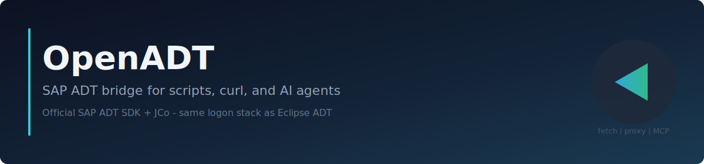

<div align="center">



# OpenADT

**SAP ADT from your terminal — same auth stack as Eclipse.**

[](https://github.com/abapify/openadt/releases)
[](LICENSE)
[](https://github.com/abapify/openadt/actions/workflows/ci.yml)
[](#-install)
[](apps/ARCHITECTURE.md)
[](https://codescene.io/projects/80949)

[](https://codescene.io/projects/80949)
[](https://codescene.io/projects/80949)
[](https://codescene.io/projects/80949)
[](https://codescene.io/projects/80949)

[Install](#-install) · [Quick start](#-quick-start) · [Use](#-use) · [MCP](#-mcp-for-ai-agents) · [Docs](docs/usage.md)

</div>

---

## What is OpenADT?

OpenADT lets you call SAP ADT from your terminal, scripts, CI, or AI agents — using the same JCo + SNC logon stack Eclipse ADT uses. One tool, three entry points:

- **`openadt fetch`** — one ADT request
- **`openadt proxy`** — a local HTTP endpoint any IDE / `curl` can use
- **`openadt mcp serve`** — gives any AI agent the official SAP ADT MCP tools

You bring JCo and (if needed) `sapcrypto` from your SAP install. OpenADT does the rest.

---

## 📦 Install

### Windows (Scoop)

```powershell
scoop bucket add openadt https://github.com/abapify/scoop-bucket
scoop install openadt
```

### Linux & macOS (Homebrew)

```bash
brew tap abapify/openadt
brew install openadt
```

### Build from source

```bash
git clone https://github.com/abapify/openadt.git
cd openadt
./mvnw -q verify -Pdistribution
```

> You'll also need: **SAP JCo 3.x** (jar + native for your OS). For SNC SSO add **CryptoLib / `sapcrypto`**. Both come from your SAP or corporate install — OpenADT does not bundle them.

---

## 🚀 Quick start

```bash
# Detect your SAP systems and JCo from SAP GUI / Eclipse
openadt config bootstrap

# Build the SDK runtime (needed for the default transport)
openadt config build

# Make a request
openadt fetch DEV /sap/bc/adt/discovery --pretty

# Or start a local proxy and reuse one warm SAP session
openadt proxy DEV --listen 127.0.0.1:8080
```

`DEV` is a placeholder for your own system alias — see what `openadt config bootstrap` produced under `~/.openadt/`.

---

## 🛠 Use

### `fetch` — one request

```bash
openadt fetch DEV /sap/bc/adt/discovery --pretty
openadt fetch DEV /sap/bc/adt/core/http/systeminformation --json
openadt fetch DEV /sap/bc/adt/programs/programs \
  --header "Accept: application/vnd.sap.adt.programs.v1+xml"
```

### `proxy` — local ADT endpoint

```bash
openadt proxy DEV --listen 127.0.0.1:8080
```

Point any client at `http://127.0.0.1:8080/sap/bc/adt/...`. Add `--local-auth basic` to require a local-only username/password (recommended for VS Code / shared boxes — those credentials are **not** SAP users):

```bash
export OPENADT_PROXY_PASSWORD="any-local-secret"
openadt proxy DEV --listen 127.0.0.1:8080 --local-auth basic --local-username openadt
```

With the proxy running, `openadt fetch` reuses the same warm session — much faster than a cold SDK start every time.

### 🪄 Auto-detection

`openadt config bootstrap` reads your existing **SAP GUI** and **Eclipse ADT** configuration and figures out your systems, JCo hostnames, SNC names, and runtime paths for you. No hand-typed host/port/SNC config. If a value is missing it picks a sensible default (current OS user, language `EN`, etc.).

Need to add a system that isn't in SAP GUI or Eclipse? `openadt config destinations create --help`.

---

## 🤖 MCP for AI agents

`openadt mcp serve` starts the **official SAP ADT MCP server** (from the SAP ADT VS Code extension) and exposes it to any agent. Two transports:

| Transport | How to connect                                                | Use when                                     |
| --------- | ------------------------------------------------------------- | -------------------------------------------- |
| **stdio** | `command: "openadt"`, `args: ["mcp","serve","--stdio"]`       | CLI agents (Cursor, Devin, Claude Desktop…)  |
| **HTTP**  | `http://localhost:2236/mcp` + `Authorization: Bearer <token>` | IDEs / agents that speak Streamable HTTP MCP |

One-time setup: install the [SAP ADT VS Code extension](https://marketplace.visualstudio.com/items?itemName=SAPSE.adt-vscode) — OpenADT drives it headlessly, VS Code does not need to stay open.

**Cursor / Claude Desktop / Devin — `.cursor/mcp.json` (or equivalent):**

```json
{
  "mcpServers": {
    "sap-adt": {
      "command": "openadt",
      "args": ["mcp", "serve", "--stdio"]
    }
  }
}
```

**Claude Code** uses **`.mcp.json`** at the repo root (same JSON shape). Keep the server key short (`sap-adt`) — Claude + AWS Bedrock reject prefixed tool names longer than 64 characters. See [docs/usage.md — MCP troubleshooting](docs/usage.md#mcp-troubleshooting).

---

## 🩺 Troubleshooting

| Problem                                            | Fix                                                                                                           |
| -------------------------------------------------- | ------------------------------------------------------------------------------------------------------------- |
| `JCo jar not configured`                           | Run `openadt config bootstrap`; check `~/.openadt/local.openadt.toml`                                         |
| `no sapjco3 in java.library.path`                  | Use the OS that owns the native lib (Windows = `sapjco3.dll`)                                                 |
| `GSS-API: No credentials` (SNC)                    | Install Secure Login on Windows or set up `SECUDIR` on Linux                                                  |
| `Connection refused` on the proxy                  | Start `openadt proxy` first; check the `--listen` port                                                        |
| Claude Code `ValidationException` (tool name ≤ 64) | Shorten MCP server key in `.mcp.json` to `sap-adt` — [MCP troubleshooting](docs/usage.md#mcp-troubleshooting) |
| Want more detail                                   | `export OPENADT_VERBOSE=true` (PowerShell: `$env:OPENADT_VERBOSE="true"`)                                     |

---

## 📖 Docs

| If you want to…                         | Read                                                              |
| --------------------------------------- | ----------------------------------------------------------------- |
| Use the installed CLI                   | [docs/usage.md](docs/usage.md)                                    |
| Set up VS Code ABAP FS via the proxy    | [docs/integrations/abap-fs.md](docs/integrations/abap-fs.md)      |
| Build from a clone                      | [docs/contributing.md](docs/contributing.md)                      |
| See the full command / config reference | [specs/cli.md](specs/cli.md) · [specs/config.md](specs/config.md) |

[Apache License 2.0](LICENSE). SAP trademarks belong to their respective owners; this project is not affiliated with SAP SE.
