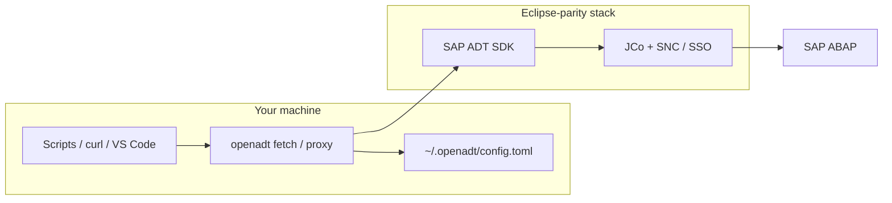

<div align="center">


# OpenADT

**SAP ADT from the terminal — same SDK and logon stack as Eclipse.**

[](https://github.com/abapify/openadt/releases)
[](LICENSE)
[](https://github.com/abapify/openadt/actions/workflows/ci.yml)
[](#install)
[](apps/ARCHITECTURE.md)

[Why](#why-openadt-exists) · [Install](#install) · [Quick start](#quick-start) · [ABAP FS](#vs-code-abap-fs-and-other-adt-clients) · [Documentation](#documentation)

</div>

---

## Why OpenADT exists

SAP ships ADT as Eclipse plugins on **JCo destinations** and corporate SSO (SNC, Secure Login). That works in the IDE; scripts, curl, and VS Code extensions do not get the same stack for free.

| Goal                                 | With OpenADT                                |
| ------------------------------------ | ------------------------------------------- |
| Call `/sap/bc/adt/...` from a script | `openadt fetch DEV /sap/bc/adt/discovery`   |
| Give a tool a simple HTTP endpoint   | `openadt proxy DEV --listen 127.0.0.1:8080` |
| Let an agent use ADT safely          | MCP over `fetch` ([preview](#mcp-preview))  |

OpenADT is a **thin wrapper around `com.sap.adt.*`** — not a reimplemented ADT HTTP client. You supply licensed JCo and ADT plugins; `openadt config bootstrap` wires them once.

## How it fits in your stack



## Install

Supported on **Windows**, **Linux**, and **macOS**. OpenADT does not bundle SAP software. Run `fetch` / `proxy` on the OS that owns your JCo natives ([platform notes](docs/usage.md#supported-platforms)).

### Windows — Scoop

```powershell
scoop bucket add openadt https://github.com/abapify/scoop-bucket
scoop install openadt
```

Without adding a bucket:

```powershell
scoop install https://raw.githubusercontent.com/abapify/openadt/main/packaging/scoop/openadt.json
```

### Linux and macOS — Homebrew

```bash
brew tap abapify/openadt
brew install openadt
```

Upgrade later: `brew update && brew upgrade openadt`

### Build from source

Contributors cloning the repo: [docs/contributing.md](docs/contributing.md).

Packaging and release channels: [specs/packaging.md](specs/packaging.md).

## Quick start

On the host where JCo/ADT are installed:

```bash
openadt config bootstrap
openadt config build          # required for default SDK transport
openadt proxy DEV --listen 127.0.0.1:8080
openadt fetch DEV /sap/bc/adt/discovery --pretty
```

Docs use fictional system aliases (`DEV`, `dev-ms.example.com`). Your `~/.openadt/config.toml` stays on your machine only.

## Commands

| Command                    | Purpose                                              |
| -------------------------- | ---------------------------------------------------- |
| `openadt fetch`            | One ADT request (SDK or explicit fallback transport) |
| `openadt proxy`            | Localhost HTTP bridge to SAP ADT                     |
| `openadt config bootstrap` | Detect landscape and write config                    |
| `openadt config build`     | Build SDK runtime jar for `fetch` / `proxy`          |
| `openadt setup`            | Legacy; prefer `config bootstrap`                    |

CLI spec: [specs/cli.md](specs/cli.md).

### Transport modes

| `adt.transport` | When                              |
| --------------- | --------------------------------- |
| `sdk` (default) | `runtime.adt_plugins_dir` set     |
| `http`          | Opt-in; ticket / browser SSO HTTP |
| `rest-rfc`      | JCo without ADT plugin pool       |

[specs/config.md](specs/config.md) · [specs/cli.md](specs/cli.md)

## VS Code (ABAP FS) and other ADT clients

[ABAP FS](https://marcellourbani.github.io/vscode_abap_remote_fs/) and similar tools expect an ADT **URL + HTTP Basic auth**. On SNC/SSO landscapes, do not store a SAP password in VS Code: run **`openadt proxy`** with **local** Basic auth and set ABAP FS `url` to `http://127.0.0.1:8080`.

**Step-by-step for Windows, Linux, and macOS:** [docs/integrations/abap-fs.md](docs/integrations/abap-fs.md)

Proxy behavior (header stripping, local vs SAP credentials): [specs/proxy.md](specs/proxy.md)

| Client                                   | OpenADT                      |
| ---------------------------------------- | ---------------------------- |
| ABAP FS ADT connection                   | Proxy + local Basic          |
| ABAP FS MCP (`localhost:4847`)           | Separate; VS Code stays open |
| Other MCP/HTTP tools with ADT Basic auth | Same proxy pattern           |

## MCP preview

SAP ADT MCP via `openadt mcp serve --stdio` (stdio bridge to native SAP HTTP MCP).

- [specs/mcp.md](specs/mcp.md) — specification
- [.cursor/mcp.json](.cursor/mcp.json) — Cursor / agent MCP config (`bun run mcp:stdio`)
- [tools/sap-adt-mcp-launcher/](tools/sap-adt-mcp-launcher/)

**Test it:** `bun run test:mcp:stdio` — verifies stdio → HTTP proxy flow end-to-end

### Prerequisites — VS Code + SAP ADT extension

OpenADT does not redistribute the SAP ADT MCP server binary (`adt-lsc`) due to SAP's license terms. The binary ships exclusively inside the official VS Code extension.

**1. Install Visual Studio Code**

> <https://code.visualstudio.com/download>

**2. Install ABAP Development Tools for VS Code**

> Extension ID: `SAPSE.adt-vscode`
> Marketplace: <https://marketplace.visualstudio.com/items?itemName=SAPSE.adt-vscode>

Quick install — press `Ctrl+P` in VS Code, paste, and press **Enter**:

```
ext install SAPSE.adt-vscode
```

This extension provides `adt-lsc` and the licensed ADT packages that power the MCP server. VS Code does **not** need to stay open during normal operation — only the extension install is required.

**3. Configure a destination in VS Code** (first-time only)

1. Open the Command Palette (`Ctrl+Shift+P`).
2. Run **ABAP: New Destination** and choose **RFC** (on-premise / private cloud) or **HTTP** (public cloud).
3. Enter your connection details.

The destination is then available to the OpenADT MCP launcher without further VS Code interaction.

SAP ADT MCP tools reference: <https://help.sap.com/docs/abap-cloud/abap-development-tools-for-visual-studio-code/mcp-tools>

## What OpenADT is not

- Not an Eclipse ADT or SAP GUI replacement
- Not a per-request landscape scanner
- Not a redistribution of SAP JCo, ADT plugins, or Secure Login

[specs/vision.md](specs/vision.md) · [apps/ARCHITECTURE.md](apps/ARCHITECTURE.md)

## Documentation

| Topic                   | Link                                                                                 |
| ----------------------- | ------------------------------------------------------------------------------------ |
| Using installed OpenADT | [docs/usage.md](docs/usage.md)                                                       |
| Developing (git clone)  | [docs/contributing.md](docs/contributing.md)                                         |
| ABAP FS integration     | [docs/integrations/abap-fs.md](docs/integrations/abap-fs.md)                         |
| Proxy                   | [specs/proxy.md](specs/proxy.md)                                                     |
| Packaging               | [specs/packaging.md](specs/packaging.md)                                             |
| SDD (specs)             | [DESIGN.md](DESIGN.md) enforcement · [specs/](specs/)                                |
| PR / review (agents)    | [REVIEW.md](REVIEW.md) · [CONTRIBUTING.md](CONTRIBUTING.md) · [AGENTS.md](AGENTS.md) |

## License

[Apache License 2.0](LICENSE). SAP trademarks belong to their respective owners; this project is not affiliated with SAP SE.
