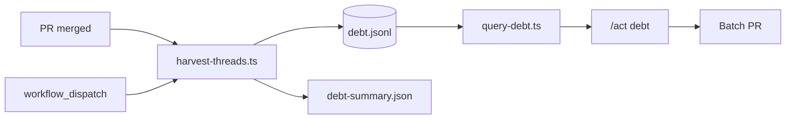

# Review debt harvest — implementation plan

**Status:** Phase 1 drafted (ledger + harvest + query + workflow + ACT skill).  
**Backlog:** [.agents/backlog/2026-06-09-review-debt-harvest.md](../../.agents/backlog/2026-06-09-review-debt-harvest.md)

## Problem

`/act` on one PR until `open_threads=0` does not scale when many AI reviewers comment in parallel. Each fix → push → CI → new comments can consume a full day per PR.

## Solution

**Two lanes:**

1. **Ship lane** — merge when required CI + human blockers are clear (AI nits may stay open).
2. **Debt lane** — on merge, **harvest** unresolved threads into `.agents/review-debt/debt.jsonl`; batch-fix with `/act debt`.

Harvest is **not** part of `/act` and does **not** run on every push.

## Architecture

## Triggers

| Trigger                            | When       | Scope             |
| ---------------------------------- | ---------- | ----------------- |
| `pull_request` `closed` + `merged` | Each merge | That PR only      |
| `workflow_dispatch`                | Manual     | `pr_number` input |

Do **not** harvest on: every `/act`, every CI run, generic push to `main`.

## Ledger (why not issues)

| Need                          | Ledger                                    |
| ----------------------------- | ----------------------------------------- |
| Query by area / author        | `query-debt.ts --area`                    |
| See duplicate nits across PRs | `fingerprint` + `--duplicates`            |
| Stable link to GitHub thread  | `thread_id`, `thread_url`                 |
| Agent batch input             | TSV from `query-debt.ts`                  |
| Temporal audit                | `harvested_at`, `merged_at`, `times_seen` |

## `/act` modes

| Command                | Mode                                     |
| ---------------------- | ---------------------------------------- |
| `/act`                 | PR in context — P0–P6 unchanged          |
| `/act 42`              | PR #42                                   |
| `/act debt`            | Open ledger rows → new batch PR          |
| `/act debt --limit 25` | Cap batch size                           |
| `/act all`             | Alias for `/act debt` when no PR context |

## Phase 1 (this PR)

- [x] `scripts/act/review-debt-lib.ts`
- [x] `scripts/act/harvest-threads.ts`
- [x] `scripts/act/query-debt.ts`
- [x] `.agents/review-debt/*`
- [x] `.github/workflows/review-debt-harvest.yml`
- [x] ACT skill — debt mode section
- [x] `REVIEW.md` merge-policy note
- [ ] Tune `config.json` bot list on first real harvest
- [ ] Confirm `github-actions[bot]` can push ledger to `main`

## Phase 2

- [x] `update-debt-status.ts` (`done` / `wontfix` after debt PR merge)
- [x] `plan-debt-batch.ts` — group by `area`
- [ ] Auto-reply on source PRs via `reply-threads.sh`
- [ ] Optional: harvest `extract-findings.ts` scan rows as `priority: scan`

## Phase 3

- [ ] Join P5 `review_scores.csv` → auto-`wontfix` for score 0–1
- [ ] Archive `done` rows to `debt-archive-YYYY.jsonl`
- [ ] Ledger update via bot PR instead of direct push to `main` (if noise)

## Open decisions

1. Direct push of ledger to `main` vs bot PR per harvest (MVP: direct push).
2. Default batch size for `/act debt` (suggest 25).
3. Expand `ignore_authors` / `nit_authors` from your reviewer fleet.
