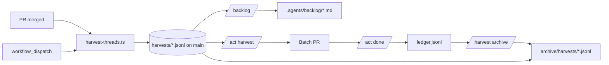

# Review debt harvest — implementation plan

**Status:** Phase 1 shipped (ledger + harvest + query + workflow + ACT skill).  
**Backlog:** [.agents/backlog/2026-06-09-review-debt-harvest.md](../../.agents/backlog/2026-06-09-review-debt-harvest.md)  
**Skill split (Phase 1.5):** `/harvest` owns collect; `/backlog` owns triage + archive; `/act` owns the fix loop. See [`.agents/skills/harvest/SKILL.md`](../agents/skills/harvest/SKILL.md).

## Problem

`/act` on one PR until `open_threads=0` does not scale when many AI reviewers comment in parallel. Each fix → push → CI → new comments can consume a full day per PR.

## Solution

**Two lanes:**

1. **Ship lane** — merge when required CI + human blockers are clear (AI nits may stay open).
2. **Debt lane** — on merge, **harvest** unresolved threads into `.agents/review-debt/harvests/*.jsonl`; batch-fix with `/act harvest`.

Harvest is **not** part of `/act` and does **not** run on every push.

## Architecture

## Triggers

| Trigger                                           | When           | Scope                                      |
| ------------------------------------------------- | -------------- | ------------------------------------------ |
| `pull_request` `closed` + `merged`                | Each merge     | That PR only (immediate)                   |
| `workflow_run` `CI` `completed` on `pull_request` | PR CI finishes | Merged PR only (deferred; merge-before-CI) |
| `workflow_dispatch`                               | Manual         | PR filters (see below)                     |

Do **not** harvest on: every `/act`, every CI run, generic push to `main`.

### `workflow_dispatch` filters

| Input                           | Meaning                                              |
| ------------------------------- | ---------------------------------------------------- |
| `pr_numbers`                    | Comma-separated merged PR ids (`72,67`)              |
| `merged_since` / `merged_until` | UTC date range (inclusive days)                      |
| `last_n`                        | After filters, keep N most recently merged           |
| `pr_author`                     | Who opened the PR                                    |
| `labels`                        | Comma-separated; **all** must match                  |
| `thread_author`                 | Review comment author (substring, e.g. `codeant-ai`) |
| `list_only`                     | Print matching PRs without harvesting                |

## Ledger (why not issues)

| Need                          | Ledger                                                   |
| ----------------------------- | -------------------------------------------------------- |
| Query by area / author        | `bun run act:debt:query -- --area …`                     |
| See duplicate nits across PRs | `fingerprint` + `bun run act:debt:query -- --duplicates` |
| Stable link to GitHub thread  | `thread_id`, `thread_url`                                |
| Agent batch input             | TSV from `bun run act:debt:query -- --format tsv`        |
| Temporal audit                | `harvested_at`, `merged_at`, `times_seen`                |

## Skill split (Phase 1.5)

| Skill      | Owns             | Reads                                             | Writes                                                         |
| ---------- | ---------------- | ------------------------------------------------- | -------------------------------------------------------------- |
| `/harvest` | collect          | GitHub PR                                         | `harvests/*.jsonl`, `debt-summary.json` on `main`              |
| `/backlog` | triage + archive | `harvests/*.jsonl` (+ `ledger.jsonl` for archive) | `.agents/backlog/*.md`, `archive/harvests/*`                   |
| `/act`     | fix              | source PRs (or backlog)                           | product code + batch PR + `ledger.jsonl` (via `act:debt:done`) |

The only cross-skill dependency is the read-only import of
`.agents/skills/harvest/scripts/review-debt-{lib,gh,text}.ts` from `/act` and
`/backlog`. No skill writes into another skill's home directory.

## `/act` contexts

| Command                            | Source                                 |
| ---------------------------------- | -------------------------------------- |
| `/act` (or `/act pr`)              | Live PR                                |
| `/act plan`                        | `.agents/plans/*.md` (future)          |
| `/act backlog`                     | `.agents/backlog/*.md`                 |
| `/act harvest` (alias `/act debt`) | `.agents/review-debt/harvests/*.jsonl` |

## Phase 1

- [x] `.agents/skills/harvest/scripts/review-debt-lib.ts`
- [x] `.agents/skills/harvest/scripts/harvest-threads.ts`
- [x] `.agents/skills/act/scripts/query-debt.ts`
- [x] `.agents/review-debt/*`
- [x] `.github/workflows/review-debt-harvest.yml`
- [x] ACT skill — debt context section
- [x] `REVIEW.md` merge-policy note
- [ ] Tune `config.json` bot list on first real harvest
- [x] Harvest → append-only `harvests/{timestamp}-pr-{N}-run-{id}.jsonl` + push to `main` (rebase retry; no harvest bot PR)
- [x] Status updates → `ledger.jsonl` overlays (`update-debt-status.ts`)

## Phase 1.5 (skill split)

- [x] `/harvest` skill (collect + archive)
- [x] `/act` debt → `harvest` context alias
- [x] `/backlog` writes triage, owns archive pass
- [x] Cross-skill dependency collapsed to one (read of `review-debt-{lib,gh,text}.ts`)

## Phase 2

- [x] `update-debt-status.ts` (`done` / `wontfix` after debt PR merge)
- [x] `plan-debt-batch.ts` — group by `area`
- [ ] Auto-reply on source PRs via `reply-threads.sh`
- [ ] Optional: harvest `extract-findings.ts` scan rows as `priority: scan`

## Phase 3

- [ ] Join P5 `review_scores.csv` → auto-`wontfix` for score 0–1
- [ ] Archive `done` rows to `debt-archive-YYYY.jsonl`
- [x] Ledger harvest via append-only files under `harvests/` on `main`
- [x] Move fully-triaged harvest files into `archive/harvests/` (`bun run harvest:archive`)

## Open decisions

1. ~~Monolithic `debt.jsonl` push~~ → **append-only harvest files** pushed to `main` (unique paths per run).
2. Default batch size for `/act harvest` (suggest 25).
3. Expand `ignore_authors` / `nit_authors` from your reviewer fleet.
4. Archive marker format — `.archived.json` per file with `{archived_at, rows}` is enough for now.
