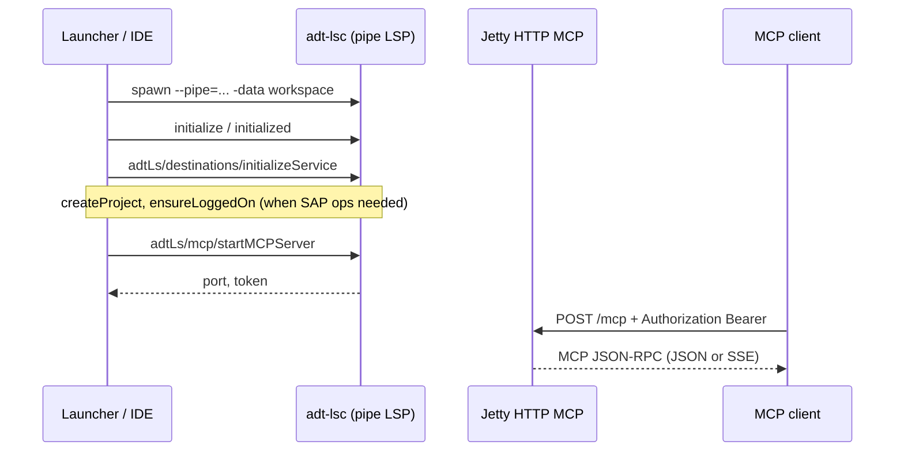
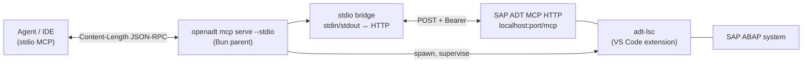

# SAP ADT MCP (mesh)

OpenADT ships `@openadt/adt-mcp` — a **unified MCP mesh** that merges two tool groups behind one endpoint:

| Group           | Source                                                                   |
| --------------- | ------------------------------------------------------------------------ |
| SAP `abap_*`    | Proxied from the **official SAP ADT MCP** (HTTP `/mcp`) inside `adt-lsc`  |
| OpenADT `adt_*` | Run **in-process** over the same `adt-lsc` LSP connection (26 tools)      |

It also adds OpenADT-owned workflow **prompts** (authored in TypeScript) and shortens long SAP tool names for
agent backends with name limits. One owned `adt-lsc` child backs both groups. The mesh serves **stdio**
(default) or **HTTP** (`--http`), driven entirely by the CLI (`serve` / `status` / `stop` / `list` /
`print-config`). The official SAP layer is still SAP-owned — OpenADT orchestrates it and adds the `adt_*` group
and prompts on top.

| Transport       | Who connects                    | Detail                                                            |
| --------------- | ------------------------------- | ----------------------------------------------------------------- |
| `serve` (stdio) | Agent/IDE with stdio MCP        | Content-Length / NDJSON on stdin/stdout; the merged mesh surface  |
| `serve --http`  | Agent/IDE with HTTP MCP support | `http://localhost:<port>/mcp` + Bearer; the merged mesh surface   |

### SAP source modes

The SAP `abap_*` group can come from three sources (the `adt_*` group needs the owned LSP connection, so it is
available in **own** mode only):

| Mode              | Trigger                            | `adt-lsc`      | `adt_*` | `abap_*` |
| ----------------- | ---------------------------------- | -------------- | ------- | -------- |
| **own** (default) | `serve`                            | spawned, owned | ✅      | ✅       |
| **attach**        | `serve --sap-port N [--sap-token]` | external       | —       | ✅       |
| **shared**        | `serve --shared`                   | shared daemon  | —       | ✅       |

Implementation: `packages/adt-mcp/` (mesh server, CLI, transports), reusing `@openadt/adt-lsp-client`
(`connectAdtLanguageServer`, `LspConnectionTransport`) and `@openadt/adt-lsp-mcp-tools` (the `adt_*` handlers).
The lower-level SAP HTTP MCP and `adtLs/mcp/*` control plane documented below are still used verbatim by the
mesh's own mode.

---

## Product: `openadt-mcp`

`openadt-mcp` is a **standalone installable** compiled Bun binary. It is the same launcher described in this spec, packaged and versioned independently from the `openadt` Java product.

| Aspect             | Contract                                                                                                                                                                                                                 |
| ------------------ | ------------------------------------------------------------------------------------------------------------------------------------------------------------------------------------------------------------------------ |
| CLI surface        | `openadt-mcp <subcommand> [args]` — same subcommands as `openadt mcp` (`serve`, `serve --stdio`, `list`, `status`, `stop`, `bridge`, `print-config`). No `openadt` prefix; the binary name is the product name.          |
| Runtime dependency | **None beyond SAP ADT VS Code extension.** Bun is **not** required at install time; the binary embeds the runtime.                                                                                                       |
| Daemon spawn       | `serve --stdio` cold start **re-execs the binary itself** via `process.execPath`; there is no `bun main.ts` lookup on disk. See [mcp-shared-backend.md](mcp-shared-backend.md#launcher-resolution-resolvedetachedspawn). |
| Install            | `scoop install openadt-mcp` (Windows) or `brew install openadt-mcp` (Linux, macOS). Independent of `scoop install openadt` / `brew install openadt`.                                                                     |
| Endpoint store     | `~/.openadt/mcp/endpoints/<port>.json` (unchanged).                                                                                                                                                                      |
| In-repo dev paths  | Unchanged: `bun run mcp:stdio`, `./dev-openadt mcp`, `openadt-mcp-dev` shim. Dev path still uses Bun + source from `packages/adt-mcp/`.                                                                        |
| Java wrapper       | `openadt mcp …` stays and **wraps** `openadt-mcp`. The wrapper resolves and spawns the binary; see [cli.md](cli.md#openadt-mcp).                                                                                         |
| Release artifact   | `openadt-mcp-X.Y.Z-{platform}.{zip\|tar.gz}` per release — see [packaging.md](packaging.md).                                                                                                                             |

`openadt-mcp serve --stdio` is equivalent to the current `openadt mcp serve --stdio`; the Java wrapper exists for users who only have the `openadt` package and for `.cursor/mcp.json` configs that prefer the single `openadt` binary on PATH.

---

## Official SAP ADT MCP server interface

Authoritative contract for the **SAP-owned** MCP (inside `adt-lsc` from `sapse.adt-vscode`). OpenADT does not reimplement this layer; the launcher orchestrates it.

### Two layers

| Layer             | Transport                                   | Purpose                                                   |
| ----------------- | ------------------------------------------- | --------------------------------------------------------- |
| **Control plane** | Named **pipe** LSP (JSON-RPC) on `adt-lsc`  | Start/stop HTTP MCP, destinations, SAP logon              |
| **Data plane**    | **HTTP** `POST http://localhost:<port>/mcp` | MCP protocol: `initialize`, `tools/list`, `tools/call`, … |

SAP provides **no native stdio MCP**. Agents that only speak stdio must use OpenADT `serve --stdio` (HTTP → stdio proxy).



### Step 1 — Spawn `adt-lsc`

Binary from the SAP ADT VS Code extension (`packages/adt-mcp/src/locate.ts`, override `ADT_LS_PATH`).

**Pipe mode (production):**

```text
adt-lsc --pipe=<pipeName> -consoleLog -Djco.trace_path=<workspace> -data <workspace>
```

- Parent **listens on the pipe first**, then spawns the child with `--pipe=<sameName>`.
- Pipe name: `\\.\pipe\lsp-<32 hex>-sock` (Windows) via `generateRandomPipeName()` (vscode-jsonrpc).
- LSP is **not** carried on child stdio.

### Step 2 — LSP handshake (required before MCP)

| Step | LSP method                             | Notes                                                                                                      |
| ---- | -------------------------------------- | ---------------------------------------------------------------------------------------------------------- |
| 1    | `initialize`                           | Must include `initializationOptions.userAgentInfos` (ADT VS Code + client); omit → logon NPE in `adt-lsc`. |
| 2    | `initialized`                          | Notification (empty params).                                                                               |
| 3    | `adtLs/destinations/initializeService` | Named params: `destinationsStorePath`, `workspaceFolderUris`, `fileUris`.                                  |
| 4    | `adtLs/destinations/createProject`     | Optional; destination id string param.                                                                     |
| 5    | `adtLs/destinations/ensureLoggedOn`    | Optional; SSO / Secure Login / browser handlers on the LSP connection.                                     |

OpenADT reference: `packages/adt-mcp/src/lsp-client.ts`, `logon-handlers.ts`.

### Step 3 — LSP MCP control plane (`adtLs/mcp/*`)

JSON-RPC segment `@JsonSegment("adtLs/mcp")` on the **same pipe LSP connection**. Params use **named objects** (`ParameterStructures.byName`), not positional arrays.

#### `adtLs/mcp/startMCPServer`

**Request params:**

| Field   | Type   | Rules                                                                                   |
| ------- | ------ | --------------------------------------------------------------------------------------- |
| `port`  | int    | **1024–65535**; port must be free on localhost                                          |
| `token` | string | Optional; if omitted or empty, SAP generates a URL-safe Base64 secret (16 random bytes) |

**Response:**

| Field   | Type   | Notes                                                                                                 |
| ------- | ------ | ----------------------------------------------------------------------------------------------------- |
| `port`  | int    | Actual bound port (may differ from request only if SAP rebind logic changes; normally equals request) |
| `token` | string | Bearer token for HTTP MCP                                                                             |

There is **no** `version` field in the LSP response (verified on `sapse.adt-vscode` 1.0.0 / `com.sap.adt.ls`). Server info version `"1.0.0"` appears in the HTTP MCP `initialize` result (`serverInfo`), not here.

**Semantics:**

- Starts embedded Jetty on **`localhost`** only, MCP endpoint **`/mcp`**.
- If HTTP MCP is already running in this `adt-lsc` instance: **no restart** — updates Bearer token and returns current port.
- `startMCPServer` may return before HTTP accepts connections; clients must poll (OpenADT: `waitForMcpHttp`).

#### `adtLs/mcp/stopMCPServer`

No params. Stops Jetty MCP listener. Response: success string.

#### `adtLs/mcp/setDestination`

**Request params:** `{ "destinationId": "<id>" }`.

Optional after start. Registers **destination-scoped dynamic IDE-action tools** on the running HTTP MCP server. Static extension tools are registered at `startMCPServer` without this call.

OpenADT calls this when `--destination` is set (`packages/adt-mcp/src/mcp.ts`).

### Step 4 — HTTP MCP data plane

After `startMCPServer`, MCP clients talk **HTTP**, not LSP.

| Item           | Value                                                                                                          |
| -------------- | -------------------------------------------------------------------------------------------------------------- |
| URL            | `http://localhost:<port>/mcp`                                                                                  |
| Method         | `POST`                                                                                                         |
| Auth           | `Authorization: Bearer <token>` (required; missing/invalid → **401**)                                          |
| `Host`         | Must be `localhost` or `127.0.0.1` (DNS rebinding filter)                                                      |
| `Content-Type` | `application/json`                                                                                             |
| `Accept`       | `application/json, text/event-stream`                                                                          |
| Session        | `Mcp-Session-Id` request/response header (streamable HTTP MCP); preserve across requests in one client session |

**First MCP request** (example):

```json
{
  "jsonrpc": "2.0",
  "id": 1,
  "method": "initialize",
  "params": {
    "protocolVersion": "2024-11-05",
    "capabilities": {},
    "clientInfo": { "name": "my-client", "version": "1.0" }
  }
}
```

Then `notifications/initialized`, `tools/list`, `tools/call`, etc.

**Implementation notes (SAP `com.sap.adt.mcp.core`, for debugging only):**

- Jetty + `HttpServletStreamableServerTransportProvider` with `.mcpEndpoint("/mcp")`.
- `McpServer.sync(...).serverInfo("ADT MCP Server", "1.0.0")`.
- Filters: Bearer auth → DNS rebinding → MCP servlet.

### Minimum startup checklist

```text
1. adt-lsc --pipe=... -data <workspace>
2. LSP initialize → initialized
3. adtLs/destinations/initializeService
4. [createProject + ensureLoggedOn when SAP backend access is required]
5. adtLs/mcp/startMCPServer { port, token }
6. POST http://localhost:<port>/mcp  (Authorization: Bearer <token>)
7. MCP initialize → notifications/initialized → tools/list
```

### SAP constraints (not negotiable in OpenADT)

| Constraint               | Detail                                                                                   |
| ------------------------ | ---------------------------------------------------------------------------------------- |
| No stdio MCP from SAP    | HTTP only; OpenADT stdio bridge is external                                              |
| No MCP without `adt-lsc` | Cannot start HTTP MCP without LSP control plane                                          |
| Localhost only           | Remote bind not supported                                                                |
| Port range               | 1024–65535                                                                               |
| VS Code default port     | Extension default **2236** — conflicts if both VS Code MCP and OpenADT use the same port |

Local decompiled research may exist under gitignored `tmp/sap-adt-mcp-decompiled/`; **this spec section is the merge gate**, not `tmp/`.

---

## Architecture (`serve --stdio`)

One OS process (Bun launcher). One child (`adt-lsc`). One local HTTP MCP backend. One stdio front-end.



### Parent process owns

1. **Child**: `adt-lsc` from `sapse.adt-vscode` (override: `ADT_LS_PATH`).
2. **LSP session**: pipe transport, `initialize`, `adtLs/destinations/*`, logon handlers (SSO / Secure Login / browser).
3. **HTTP MCP**: `adtLs/mcp/startMCPServer` → `{ port, token }` (see [Official SAP ADT MCP server interface](#official-sap-adt-mcp-server-interface)).
4. **Stdio MCP surface**: read framed messages from stdin, forward to `http://localhost:<port>/mcp` with `Authorization: Bearer <token>`, write responses to stdout.

Token never leaves the parent; agent config is command-only (no URL/headers).

---

## Command reference

| Command          | Role                                                            |
| ---------------- | -------------------------------------------------------------- |
| `serve`          | Mesh over **stdio** (own `adt-lsc`); default                   |
| `serve --http`   | Mesh over **HTTP** `/mcp` + Bearer on localhost                |
| `status`         | Probe active endpoint health                                   |
| `list`           | List active endpoints in the store                             |
| `stop`           | Stop tracked MCP backend(s)                                    |
| `print-config`   | Emit `{ url, headers }` for HTTP-native clients                |

```bash
bun run mcp:stdio                                  # stdio mesh (IDE/agent config)
adt-mcp serve --http --port 2236                   # HTTP mesh
adt-mcp serve --no-lsp                             # SAP abap_* only
adt-mcp serve --sap-port 2236 --sap-token <tok>    # attach to a running SAP MCP
adt-mcp list
adt-mcp print-config --port 2236
```

Run via `bun packages/adt-mcp/src/cli.ts …` (clone) or `openadt-mcp …` (Scoop/Homebrew). Requires **Bun** and
the SAP ADT VS Code extension.

### `serve` flags

| Flag                     | Default                       | Meaning                                                 |
| ------------------------ | ----------------------------- | ------------------------------------------------------- |
| `--http`                 | off (stdio)                   | Serve the mesh over Streamable HTTP `/mcp`              |
| `--port`                 | `2236`                        | Mesh HTTP port (`--http`); else SAP backend port        |
| `--workspace`            | `~/.openadt/adt-ls-workspace` | Eclipse `-data` for `adt-lsc`                           |
| `--lsp` / `--no-lsp`     | `--lsp`                       | Include / exclude the OpenADT `adt_*` group (own mode)  |
| `--proxy` / `--no-proxy` | `--proxy`                     | Include / exclude the SAP `abap_*` group                |
| `--sap-port` N           | —                             | Attach to an external SAP MCP on this port              |
| `--sap-token` T          | endpoint store                | Bearer token for `--sap-port`                           |
| `--shared`               | off                           | Reuse a healthy shared daemon from the endpoint store   |
| `--destination`          | (all derived)                 | Pre-logon + `setDestination` for one destination        |
| `--logon-timeout`        | `300`                         | Seconds for `ensureLoggedOn`                            |
| `--show-token`           | off                           | Print the Bearer token on `--http`                      |
| `--verbose` / `--log-file` | off                         | Debug logging                                           |

Destinations are **auto-derived** from `~/.adtls/destinations.json` (`ADTLS_HOME` to override the directory);
there is no `--import` flag — point `--workspace` at the data directory and destinations are pulled in.

### stdio streams

| Stream     | Content                                                                         |
| ---------- | ------------------------------------------------------------------------------- |
| **stdout** | MCP messages only (Content-Length or NDJSON framing, matching client transport) |
| **stderr** | Startup, logon hints, errors (never MCP payload)                                |
| **stdin**  | Client → server MCP messages                                                    |

---

## Contract: `openadt mcp serve --stdio`

### Startup (required order)

1. **Start stdin reader immediately** — buffer incoming frames while SAP starts (client may send `initialize` before HTTP is ready).
2. **Locate extension** — fail with clear error if `sapse.adt-vscode` missing.
3. **Spawn `adt-lsc`** — child process with bundled JRE; register logon handlers.
4. **LSP + destinations** — `initialize`, `adtLs/destinations/initializeService`, `createProject`, `ensureLoggedOn` (SSO window if needed).
5. **Start HTTP MCP** — `adtLs/mcp/startMCPServer` with generated Bearer token.
6. **Wait until HTTP accepts requests** — poll `/mcp` until listener responds (OpenADT: `OPTIONS` + Bearer, or any HTTP status ≠ connection refused). Do **not** poll with repeated MCP `initialize` POSTs (leaks sessions / stalls stdio).
7. **Attach stdio bridge** — forward buffered + live stdin messages to HTTP with token; write HTTP responses to stdout unchanged (JSON or SSE `data:` lines).

### Proxy semantics (transparent)

- **Every** client JSON-RPC request is forwarded to HTTP MCP (including `initialize`, `tools/list`, notifications).
- **No** stub or synthetic `initialize` result from OpenADT.
- Preserve `Mcp-Session-Id` header across requests in one stdio session.
- **Stdout framing:** `node:stream` `Transform` encoder piped to `process.stdout` (backpressure end-to-end). `McpFrameDecoder` on stdin. See `mcp-framing.ts`.
- **Content-Length is byte count:** frame-parse stdout as bytes (`Buffer` / stream), not UTF-16 string length (tool metadata may contain non-ASCII).
- **Dual stdin transport:** auto-detect **Content-Length** (Cursor IDE, MCP spec) vs **NDJSON** single-line JSON (Cursor **agent CLI**). Reply using the same transport the client used.
- Parse HTTP body: `application/json` or `text/event-stream` (`data:` lines).
- On HTTP/network failure: JSON-RPC error to client if the request had an `id`.

### Shutdown (required)

When any of: client closes stdin, SIGINT, SIGTERM, unrecoverable child exit:

1. Stop forwarding new stdin messages.
2. Drain in-flight HTTP forwards.
3. **`adtLs/mcp/stopMCPServer`** via LSP (best effort).
4. **Kill `adt-lsc` process tree** (child must not outlive parent).
5. Remove `~/.openadt/mcp/endpoints/<port>.json` if this instance wrote it.
6. Exit (non-zero if startup or logon failed before bridge was ready).

Parent exit **must** tear down HTTP MCP and `adt-lsc`; orphaned `adt-lsc` on port 2236 is a bug.

### Failure modes

| Condition                       | Client-visible behavior                             | Exit code |
| ------------------------------- | --------------------------------------------------- | --------- |
| Extension missing               | JSON-RPC error on first request with `id`; exit `1` | 1         |
| Logon timeout / no SSO          | JSON-RPC error; stderr explains Secure Login        | 1         |
| Port in use                     | stderr message; exit `4`                            | 4         |
| HTTP never ready within timeout | JSON-RPC error on queued requests; exit `3`         | 3         |
| Multiple active endpoints       | stderr + `mcp list` message; exit `5`               | 5         |
| Ensure lock timeout             | stderr; exit `6`                                    | 6         |
| Daemon spawn failed             | stderr; exit `7`                                    | 7         |

Exit codes 5-7: see [mcp-shared-backend.md](mcp-shared-backend.md).

First client message may wait **minutes** during SAP logon; that is expected. Do not exit before responding or erroring on buffered requests.

---

## HTTP-only clients (`serve` without `--stdio`)

For agents that support Streamable HTTP MCP (URL + headers):

```bash
./dev-openadt mcp serve --port 2236
./dev-openadt mcp print-config --port 2236
```

```json
{
  "url": "http://localhost:2236/mcp",
  "headers": {
    "Authorization": "Bearer <token>",
    "User-Agent": "openadt-mcp-client"
  }
}
```

Use when stdio bridge is unnecessary. Token from endpoint store or `print-config`; not printed on default `serve` output.

---

## Agent config (stdio)

**Repo-local only.** Put MCP settings in `.cursor/mcp.json` at the repository root. Do **not** add OpenADT to global `~/.cursor/mcp.json`.

Do **not** set `"cwd": "${workspaceFolder}"` — some agent builds break MCP spawn with it. Run `agent` from the repo root (Cursor already uses the workspace as cwd for project MCP).

**All platforms**:

```json
{
  "mcpServers": {
    "sap-adt": {
      "command": "bun",
      "args": ["run", "mcp:stdio"]
    }
  }
}
```

Requires [Bun](https://bun.sh) on `PATH` (repo `packageManager`). Script chain: `mcp:stdio` → `bun scripts/mcp-stdio.ts` → `mcp-stdio-entry.ts`. Manual/CI: `nx run adt-mcp:serve-stdio` (`cache: false`). Avoid `npx nx …` as the MCP command on Windows agent — `npx` invokes `cmd.exe`, which is absent from agent minimal `PATH`; use `bun run mcp:stdio` instead.

`mcp-stdio-entry.ts` merges `~/.openadt/local.openadt.toml` `[runtime]` paths (JCo, sapcrypto) into the child environment so agent minimal `PATH` still loads SAP natives. Windows `taskkill` uses `%SystemRoot%\\System32\\taskkill.exe` (not PATH). Entry uses **shared mode** by default: finds or spawns a detached daemon, attaches stdio bridge, does NOT kill backend on exit. Override with `OPENADT_MCP_PORT` for explicit port. **Pipes** stdin/stdout to the launcher child (stdio `inherit` breaks some MCP clients on Windows).

Run `agent` from the repository root. Stale servers are stopped at startup; kill orphans with `Get-Process adt-lsc | Stop-Process -Force` if logon hangs.

**Claude Code** uses the same schema in **`.mcp.json`** at the repo root (not `.cursor/mcp.json`). Use the same `sap-adt` server key and `bun run mcp:stdio` command as above.

Direct LSP OpenADT tools (`adt-lsp` server, `bun run mcp:adt-lsp`): [adt-lsp-mcp-local.md](adt-lsp-mcp-local.md).

### Agent backend tool name limits (Claude + AWS Bedrock)

Some agent hosts (notably **Claude Code on AWS Bedrock**) do not call MCP tools by their raw MCP name. Claude prefixes each tool as:

```text
mcp__<serverKey>__<toolName>
```

AWS Bedrock Converse rejects `toolSpec.name` values **longer than 64 characters**. SAP ADT MCP tool names can be long (for example `abap_business_services-fetch_service_information`, 49 characters). A long **server key** in `.mcp.json` / `.cursor/mcp.json` pushes the combined name over the limit.

**Budget formula (Claude + Bedrock):**

```text
len(serverKey) + len(toolName) ≤ 57    // because mcp__ (5) + __ (2) = 7 overhead
```

| Server key       | Max safe SAP tool name | Example failure                                    |
| ---------------- | ---------------------- | -------------------------------------------------- |
| `sap-adt`        | 50                     | — (longest known SAP tool fits)                    |
| `sap-adt-dev`    | 46                     | `abap_business_services-fetch_service_information` |
| `my-sap-adt-mcp` | 43                     | most business-service tools                        |

**Symptom:** project fails to start in Claude with HTTP 400 / `ValidationException`: `toolSpec.name` … `must have length less than or equal to 64`.

**Mitigations (in order):**

1. **Keep the MCP server key short** — use `sap-adt` or `adt` in `.mcp.json` and `.cursor/mcp.json`. Do **not** use descriptive suffixes like `-dev` unless you also shorten tool exposure.
2. **Stdio proxy shortening (OpenADT)** — `serve --stdio` shortens SAP tool names longer than **45 characters** in `tools/list` and maps aliases back on `tools/call` (`packages/adt-mcp/src/tool-name-limit.ts`). Override with `OPENADT_MCP_MAX_TOOL_NAME` (minimum 16).
3. **Tighter limit for long server keys** — if you must keep a long server key, set `OPENADT_MCP_MAX_TOOL_NAME` to `57 - len(serverKey)`.

Repo-local configs shipped in git must use the short key `sap-adt`. User-facing troubleshooting: [docs/usage.md](../docs/usage.md#mcp-troubleshooting).

**SECUDIR:** do not point at `~/.openadt/sec` (HTTP CA PEMs). Launcher prefers `%APPDATA%\\SAP\\Common` and sets `SNC_LIB` to configured `sapcrypto`. **Logon:** use `createProjectAndLogon` (retry on “destination does not exist” race).

---

## Endpoint store

Each `serve` / `serve --stdio` writes `~/.openadt/mcp/endpoints/<port>.json` (`url`, `token`, `pid`, `adtLscPid`, destinations, …). Mode `0600`.

- Removed on **clean shutdown** of the owning process.
- Stale entries pruned when `pid` is dead.
- Used by `list`, `status`, `print-config` — not for `--attach` (removed).

---

## Security

- Bearer tokens in endpoint store only; debug logs redact `Authorization`.
- Tests and docs: fictional fixtures (`DEV`, `dev-ms.example.com`, fake UUIDs).
- Never commit SAP JCo, sapcrypto, or landscape secrets.

---

## Implementation map

| Component              | Path                                                                         |
| ---------------------- | ---------------------------------------------------------------------------- |
| CLI entry              | `apps/openadt-cli` → `McpServeCommand` → Bun launcher                        |
| Launcher               | `packages/adt-mcp/src/main.ts`                                              |
| Stdio bridge           | `packages/adt-mcp/src/stdio-proxy.ts`                                       |
| Tool name limits       | `packages/adt-mcp/src/tool-name-limit.ts`                                   |
| Content-Length framing | `packages/adt-mcp/src/mcp-framing.ts` (`node:stream` Transform)            |
| Stdio agent entry      | `scripts/mcp-stdio.ts` → `packages/adt-mcp/src/mcp-stdio-entry.ts`          |
| LSP + logon            | `lsp-client.ts`, `logon-handlers.ts`                                         |
| HTTP MCP API           | `mcp.ts` (`startMcpServer`, `stopMcpServer`, `probeMcpHttp`)                 |
| Extension locate       | `locate.ts`                                                                  |

---

## Implementation plan (current → target)

Target is the contract above. Simplify implementation; remove experimental paths.

### Phase 1 — Spec-aligned stdio bridge

- [x] **Delete** `--attach`, `enableBootstrapUntilReady`, synthetic `initialize`, dual `prepareHttpBackend` paths.
- [x] **Single code path** in `cmdServe`: `bridge.start()` → spawn backend → `waitForMcpHttp` → `bridge.run(port, token)` until stdin close/shutdown.
- [x] **Transparent proxy only** — forward all MCP methods including `initialize`.
- [x] **Shutdown** — unified in one `shutdown()` called from signal, stdin end, and child exit.

### Phase 2 — Startup reliability

- [x] Stdin buffer + flush after HTTP ready.
- [x] `waitForMcpHttp` after `startMCPServer` (treat any HTTP response as "listening").
- [x] Logon: block in LSP connect before `startMCPServer` (synchronous logon; no deferred background logon).
- [x] Stale `adt-lsc` — stop prior owned instances on startup (endpoint store pids only).

### Phase 2b — Shared backend (auto-ensure)

- [ ] **Auto-ensure backend** — `ensureSharedBackend()` in `ensure-backend.ts` (see [mcp-shared-backend.md](mcp-shared-backend.md)).
- [ ] **Shared mode** — `serve --stdio` (default) finds or spawns a detached daemon, attaches stdio bridge, does NOT kill backend on exit.
- [ ] **`--standalone` flag** — explicit monolithic path for CI/scripts expecting owned lifecycle.
- [ ] **`mcp stop`** — stop backend manually.
- [ ] **Exit code 5** — multiple active endpoints (ambiguous attach).
- [ ] **Exit code 6** — ensure lock timeout.
- [ ] **Exit code 7** — daemon spawn failed.

### Phase 3 — Tests

- [x] Unit: frame parse, SSE parse, session header, error mapping.
- [ ] Integration (manual/`@Tag("integration")`): spawn `--stdio`, send `initialize` + `tools/list`, expect SAP tool names.
- [ ] Shutdown: after stdin close, assert port closed and no `adt-lsc` child.

### Phase 4 — Packaging & docs

- [ ] Remove `adt-mcp/` from `openadt.zip`; ship `openadt-mcp-X.Y.Z-{platform}.{zip|tar.gz}` per release (see [packaging.md](packaging.md)).
- [ ] `scoop install openadt-mcp` and `brew install openadt-mcp` are independent of `openadt` install.
- [x] `specs/cli.md` sync; remove `--attach` references from help text.
- [x] Optional: `scripts/mcp-stdio.cmd` — user-local Windows workaround only; not used in committed `.cursor/mcp.json`.

### Out of scope (explicit)

- Replacing SAP HTTP with native stdio in `adt-lsc`.
- Two-process “backend + attach” as the primary workflow.
- Cursor-specific sync scripts.

### OpenADT-owned MCP tools

OpenADT exposes additional LSP-based MCP tools (prefixed with `adt_`) that are not part of the SAP MCP server. These tools call LSP methods directly on the ADT Language Server and are available in standalone mode (`--standalone` or HTTP daemon) where the launcher has direct LSP access.

**Availability:**

- **Standalone mode** (`--standalone` or HTTP daemon): Full LSP access, agent tools available
- **Shared stdio mode** (`--stdio` without `--standalone`): No direct LSP access to daemon, agent tools not available

**Proxy modes:**

- `--proxy` (default): Serve both SAP MCP tools (proxied) and custom LSP-based tools
- `--no-proxy`: Serve only custom LSP-based tools, reject SAP tool calls

See [adt-agent-typescript.md](adt-agent-typescript.md) for the full tool reference and implementation details.

#### `@openadt/adt-lsp-mcp` (direct LSP stdio)

Package: `tools/adt-lsp-mcp/` — stdio-only MCP for the 26 `adt_*` tools. Depends on `@openadt/adt-lsp-mcp-tools` (handlers) and `@openadt/adt-lsp-client` (LSP transport). Calls `adt-lsc` over **pipe LSP** directly; there is **no** HTTP MCP bridge (`adtLs/mcp/startMCPServer` is not used).

| Item                    | Contract                                                                                                                                                                                                   |
| ----------------------- | ---------------------------------------------------------------------------------------------------------------------------------------------------------------------------------------------------------- |
| CLI                     | Optional bound destination at startup: `adt-lsp-mcp [destination]` or env `OPENADT_DESTINATION` / `OPENADT_MCP_DESTINATION`. Without it: per-tool `destination` (SAP MCP mode). Dev entry: [adt-lsp-mcp-local.md](adt-lsp-mcp-local.md) |
| Destination id          | `SID_CLIENT_USER_LANG` (e.g. `ABC_200_USER_EN`) — must exist in `~/.adtls/destinations.json`. Per-tool arg when unbound; hidden/injected when bound at startup.                                                                               |
| `destinationsStorePath` | **Directory** `~/.adtls` (contains `destinations.json`), not the file path                                                                                                                                 |
| LSP transport           | Handlers receive `LspConnectionTransport`, not raw `MessageConnection`                                                                                                                                     |
| MCP `tools/call` result | Handler return value is the JSON-RPC **`result`** field (`{ content, isError? }`), not nested under `result.result`                                                                                        |
| `tools/list` schema     | JSON Schema via `@openadt/mcp-tools`. **`destination` included** when unbound (SAP MCP parity); **omitted** when bound at startup.                                                                         |
| Startup                 | `initialize` / `tools/list` / `prompts/list` are immediate. Bound destination: LSP logon in background. Unbound: lazy LSP + logon on first `tools/call` per destination. Multi-destination supported on one session when unbound.                          |
| Transport LSP namespace | `adtLs/cts/transport/*` (not `adtLs/transport/*`)                                                                                                                                                          |
| Object URI chain        | ADT path from `adt_quick_search` → `adtLs/repository/getLsUri` → repotree/AFF URI for file/transport ops; `checkTransportForObjectLock` uses `{ objectInfo: { objectUri }, operationType }` after getLsUri |

**Guidance prompt (OpenADT-owned):**

| MCP method     | Behavior                                                                                                                     |
| -------------- | ---------------------------------------------------------------------------------------------------------------------------- |
| `prompts/list` | Includes `adt_lsp_workflow`                                                                                                  |
| `prompts/get`  | `{ "name": "adt_lsp_workflow" }` → workflow markdown (direct LSP model, destination id, transport namespace, getLsUri chain) |

Implementation: `tools/adt-lsp-mcp/src/guidance/`. E2e: generic `e2e-agent` CLI + OpenADT adapter — `bun run e2e -- run ls-N --destination <id>` (see [mcp-ai-testing.md](mcp-ai-testing.md)).

---

### Contract-first architecture (proposed)

**Goal:** Enable agent tools (currently LSP-only) to work in shared mode by decoupling the contract from the transport.

**Current limitation:**

- Agent tools require direct `MessageConnection` to LSP
- Shared mode daemon owns LSP connection; stdio bridge only has HTTP access
- Result: agent tools unavailable in shared stdio mode

**Proposed design (ts-rest-style):**

```typescript
// Transport-agnostic contract
interface AdtLsContract {
  quickSearch(params: { destination: string; pattern: string }): Promise<QuickSearchResult>;
  searchTransports(params: { destination: string; user?: string }): Promise<TransportResult>;
  // ... all other LSP methods
}

// LSP implementation (standalone mode)
class LspAdtLsClient implements AdtLsContract {
  constructor(private connection: MessageConnection) {}
  async quickSearch(params) {
    return this.connection.sendRequest("adtLs/repository/quickSearch", params);
  }
}

// HTTP implementation (shared mode)
class HttpAdtLsClient implements AdtLsContract {
  constructor private baseUrl: string, private token: string) {}
  async quickSearch(params) {
    return fetch(`${this.baseUrl}/lsp/quickSearch`, {
      method: "POST",
      headers: { "Authorization": `Bearer ${this.token}` },
      body: JSON.stringify(params)
    });
  }
}

// Agent tools use contract, not transport
class RepositoryToolSet {
  constructor(private client: AdtLsContract) {}
  async handleQuickSearch(args, ctx) {
    return this.client.quickSearch({ ... });
  }
}
```

**Implementation scope:**

1. Define `AdtLsContract` interface covering all LSP methods used by agent tools
2. Implement `LspAdtLsClient` (current behavior refactored)
3. Implement `HttpAdtLsClient` (new)
4. Refactor all agent tool sets to inject contract instead of `MessageConnection`
5. Extend daemon to expose all LSP methods as HTTP endpoints (`/lsp/*`)
6. Update stdio bridge to use `HttpAdtLsClient` in shared mode

**Benefits:**

- Agent tools work in both standalone and shared modes
- Better testability (mock contract for unit tests)
- Transport flexibility (could add gRPC, WebSocket later)
- Unified architecture with read tools (which already have backend abstraction)

**Migration path:**

- Phase 1: Define contract + LSP implementation (no behavior change)
- Phase 2: Add HTTP implementation + daemon endpoints
- Phase 3: Refactor agent tools to use contract
- Phase 4: Update stdio bridge to inject HTTP client in shared mode
- Phase 5: E2E tests for agent tools in shared mode

**Status:** Proposed. Requires spec approval and implementation planning before coding.

### AI scenario testing (live landscape)

User- or agent-supplied destination id (no SID in git). Scenarios: `e2e/scenarios/`. Contract: [mcp-ai-testing.md](mcp-ai-testing.md). Command: `bun run e2e -- run mcp-N --destination <ADT_DESTINATION_ID>`.

---

## Gap (implementation vs this spec)

### Implemented (core path)

| Area                                                           | Status |
| -------------------------------------------------------------- | ------ |
| Pipe LSP + destinations + sync logon before MCP                | Done   |
| `startMCPServer` / `stopMCPServer` / optional `setDestination` | Done   |
| HTTP client (`/mcp`, Bearer, session header)                   | Done   |
| Stdio transparent proxy + unit tests                           | Done   |
| Endpoint store + shutdown teardown                             | Done   |
| Release ZIP includes launcher (`package-release`)              | Done   |

### Open gaps (prioritized)

**Policy:** verify end-to-end behavior before removing duplicate or legacy code paths.

| Priority | Gap                                                                                 | Spec ref                            |
| -------- | ----------------------------------------------------------------------------------- | ----------------------------------- |
| P0       | Manual smoke: `--stdio` + `tools/list`; HTTP `serve` + `status`                     | Phase 3 manual                      |
| P0       | HTTP-only `serve`: confirm whether `sleep(750)` is enough or needs `waitForMcpHttp` | SAP-MCP-03                          |
| P0       | Stdio HTTP timeout: client errors vs exit code 3                                    | Failure modes                       |
| P1       | Drop unused LSP `version?` from types/logs (cosmetic)                               | Official interface § startMCPServer |
| P1       | Align `--port` validation with SAP 1024–65535 if low ports fail in practice         | Official interface                  |
| P1       | Verify `setDestination` tool registration live                                      | Official interface § setDestination |
| P2       | Integration tests: `--stdio` tools/list, shutdown                                   | Phase 3                             |
| P2       | Scoop default `serve --stdio`                                                       | Phase 4                             |

Manual acceptance: `agent mcp list-tools sap-adt` / IDE MCP reload with `serve --stdio` (SSO on cold start).
