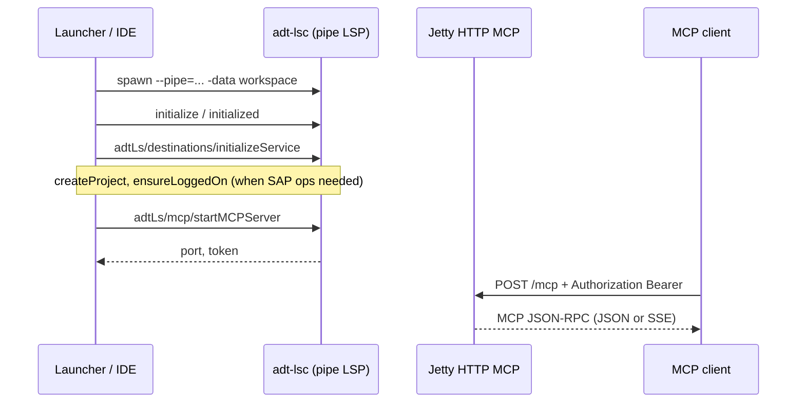
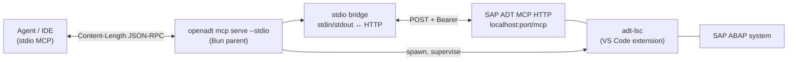

# SAP ADT MCP (launcher)

OpenADT **does not implement MCP tools**. The Bun launcher in `tools/sap-adt-mcp-launcher/` starts the **official SAP ADT MCP** from the [SAP ADT VS Code extension](https://marketplace.visualstudio.com/items?itemName=SAPSE.adt-vscode): spawn `adt-lsc` as a child process, LSP handshake, then `adtLs/mcp/startMCPServer` (HTTP + Bearer on localhost).

OpenADT adds:

| Mode                | Who connects                    | Transport                                                                   |
| ------------------- | ------------------------------- | --------------------------------------------------------------------------- |
| `mcp serve`         | Agent/IDE with HTTP MCP support | `http://localhost:<port>/mcp` + Bearer                                      |
| `mcp serve --stdio` | Agent/IDE with stdio MCP only   | Content-Length JSON-RPC on stdin/stdout → proxied to the same HTTP endpoint |

SAP exposes MCP **only over HTTP**. Stdio mode is an **OpenADT adapter**, not a second MCP server.

---

## Official SAP ADT MCP server interface

Authoritative contract for the **SAP-owned** MCP (inside `adt-lsc` from `sapse.adt-vscode`). OpenADT does not reimplement this layer; the launcher orchestrates it.

### Two layers

| Layer             | Transport                                   | Purpose                                                   |
| ----------------- | ------------------------------------------- | --------------------------------------------------------- |
| **Control plane** | Named **pipe** LSP (JSON-RPC) on `adt-lsc`  | Start/stop HTTP MCP, destinations, SAP logon              |
| **Data plane**    | **HTTP** `POST http://localhost:<port>/mcp` | MCP protocol: `initialize`, `tools/list`, `tools/call`, … |

SAP provides **no native stdio MCP**. Agents that only speak stdio must use OpenADT `serve --stdio` (HTTP → stdio proxy).



### Step 1 — Spawn `adt-lsc`

Binary from the SAP ADT VS Code extension (`tools/sap-adt-mcp-launcher/src/locate.ts`, override `ADT_LS_PATH`).

**Pipe mode (production):**

```text
adt-lsc --pipe=<pipeName> -consoleLog -Djco.trace_path=<workspace> -data <workspace>
```

- Parent **listens on the pipe first**, then spawns the child with `--pipe=<sameName>`.
- Pipe name: `\\.\pipe\lsp-<32 hex>-sock` (Windows) via `generateRandomPipeName()` (vscode-jsonrpc).
- LSP is **not** carried on child stdio.

### Step 2 — LSP handshake (required before MCP)

| Step | LSP method                             | Notes                                                                                                      |
| ---- | -------------------------------------- | ---------------------------------------------------------------------------------------------------------- |
| 1    | `initialize`                           | Must include `initializationOptions.userAgentInfos` (ADT VS Code + client); omit → logon NPE in `adt-lsc`. |
| 2    | `initialized`                          | Notification (empty params).                                                                               |
| 3    | `adtLs/destinations/initializeService` | Named params: `destinationsStorePath`, `workspaceFolderUris`, `fileUris`.                                  |
| 4    | `adtLs/destinations/createProject`     | Optional; destination id string param.                                                                     |
| 5    | `adtLs/destinations/ensureLoggedOn`    | Optional; SSO / Secure Login / browser handlers on the LSP connection.                                     |

OpenADT reference: `tools/sap-adt-mcp-launcher/src/lsp-client.ts`, `logon-handlers.ts`.

### Step 3 — LSP MCP control plane (`adtLs/mcp/*`)

JSON-RPC segment `@JsonSegment("adtLs/mcp")` on the **same pipe LSP connection**. Params use **named objects** (`ParameterStructures.byName`), not positional arrays.

#### `adtLs/mcp/startMCPServer`

**Request params:**

| Field   | Type   | Rules                                                                                   |
| ------- | ------ | --------------------------------------------------------------------------------------- |
| `port`  | int    | **1024–65535**; port must be free on localhost                                          |
| `token` | string | Optional; if omitted or empty, SAP generates a URL-safe Base64 secret (16 random bytes) |

**Response:**

| Field   | Type   | Notes                                                                                                 |
| ------- | ------ | ----------------------------------------------------------------------------------------------------- |
| `port`  | int    | Actual bound port (may differ from request only if SAP rebind logic changes; normally equals request) |
| `token` | string | Bearer token for HTTP MCP                                                                             |

There is **no** `version` field in the LSP response (verified on `sapse.adt-vscode` 1.0.0 / `com.sap.adt.ls`). Server info version `"1.0.0"` appears in the HTTP MCP `initialize` result (`serverInfo`), not here.

**Semantics:**

- Starts embedded Jetty on **`localhost`** only, MCP endpoint **`/mcp`**.
- If HTTP MCP is already running in this `adt-lsc` instance: **no restart** — updates Bearer token and returns current port.
- `startMCPServer` may return before HTTP accepts connections; clients must poll (OpenADT: `waitForMcpHttp`).

#### `adtLs/mcp/stopMCPServer`

No params. Stops Jetty MCP listener. Response: success string.

#### `adtLs/mcp/setDestination`

**Request params:** `{ "destinationId": "<id>" }`.

Optional after start. Registers **destination-scoped dynamic IDE-action tools** on the running HTTP MCP server. Static extension tools are registered at `startMCPServer` without this call.

OpenADT calls this when `--destination` is set (`tools/sap-adt-mcp-launcher/src/mcp.ts`).

### Step 4 — HTTP MCP data plane

After `startMCPServer`, MCP clients talk **HTTP**, not LSP.

| Item           | Value                                                                                                          |
| -------------- | -------------------------------------------------------------------------------------------------------------- |
| URL            | `http://localhost:<port>/mcp`                                                                                  |
| Method         | `POST`                                                                                                         |
| Auth           | `Authorization: Bearer <token>` (required; missing/invalid → **401**)                                          |
| `Host`         | Must be `localhost` or `127.0.0.1` (DNS rebinding filter)                                                      |
| `Content-Type` | `application/json`                                                                                             |
| `Accept`       | `application/json, text/event-stream`                                                                          |
| Session        | `Mcp-Session-Id` request/response header (streamable HTTP MCP); preserve across requests in one client session |

**First MCP request** (example):

```json
{
  "jsonrpc": "2.0",
  "id": 1,
  "method": "initialize",
  "params": {
    "protocolVersion": "2024-11-05",
    "capabilities": {},
    "clientInfo": { "name": "my-client", "version": "1.0" }
  }
}
```

Then `notifications/initialized`, `tools/list`, `tools/call`, etc.

**Implementation notes (SAP `com.sap.adt.mcp.core`, for debugging only):**

- Jetty + `HttpServletStreamableServerTransportProvider` with `.mcpEndpoint("/mcp")`.
- `McpServer.sync(...).serverInfo("ADT MCP Server", "1.0.0")`.
- Filters: Bearer auth → DNS rebinding → MCP servlet.

### Minimum startup checklist

```text
1. adt-lsc --pipe=... -data <workspace>
2. LSP initialize → initialized
3. adtLs/destinations/initializeService
4. [createProject + ensureLoggedOn when SAP backend access is required]
5. adtLs/mcp/startMCPServer { port, token }
6. POST http://localhost:<port>/mcp  (Authorization: Bearer <token>)
7. MCP initialize → notifications/initialized → tools/list
```

### SAP constraints (not negotiable in OpenADT)

| Constraint               | Detail                                                                                   |
| ------------------------ | ---------------------------------------------------------------------------------------- |
| No stdio MCP from SAP    | HTTP only; OpenADT stdio bridge is external                                              |
| No MCP without `adt-lsc` | Cannot start HTTP MCP without LSP control plane                                          |
| Localhost only           | Remote bind not supported                                                                |
| Port range               | 1024–65535                                                                               |
| VS Code default port     | Extension default **2236** — conflicts if both VS Code MCP and OpenADT use the same port |

Local decompiled research may exist under gitignored `tmp/sap-adt-mcp-decompiled/`; **this spec section is the merge gate**, not `tmp/`.

---

## Architecture (`serve --stdio`)

One OS process (Bun launcher). One child (`adt-lsc`). One local HTTP MCP backend. One stdio front-end.



### Parent process owns

1. **Child**: `adt-lsc` from `sapse.adt-vscode` (override: `ADT_LS_PATH`).
2. **LSP session**: pipe transport, `initialize`, `adtLs/destinations/*`, logon handlers (SSO / Secure Login / browser).
3. **HTTP MCP**: `adtLs/mcp/startMCPServer` → `{ port, token }` (see [Official SAP ADT MCP server interface](#official-sap-adt-mcp-server-interface)).
4. **Stdio MCP surface**: read framed messages from stdin, forward to `http://localhost:<port>/mcp` with `Authorization: Bearer <token>`, write responses to stdout.

Token never leaves the parent; agent config is command-only (no URL/headers).

---

## Command reference

| Command         | Role                                                           |
| --------------- | -------------------------------------------------------------- |
| `serve`         | Child `adt-lsc` + HTTP MCP; hold until Ctrl+C; **no stdio**    |
| `serve --stdio` | Same backend **plus** stdio bridge (single process, see below) |
| `status`        | Probe HTTP MCP (`initialize` POST)                             |
| `list`          | List active endpoints in store                                 |
| `print-config`  | Emit `{ url, headers }` for HTTP-native clients                |

```bash
./dev-openadt mcp serve --port 2236
./dev-openadt mcp serve --stdio
./dev-openadt mcp serve --stdio --port 2236 --destination DEV_100_developer_en
./dev-openadt mcp list
./dev-openadt mcp print-config --port 2236
```

Run via `./dev-openadt mcp …` (clone) or `openadt mcp …` (Scoop/Homebrew). Requires **Bun** and SAP ADT VS Code extension.

### `serve` flags (HTTP backend)

| Flag                       | Default                       | Meaning                                                 |
| -------------------------- | ----------------------------- | ------------------------------------------------------- |
| `--port`                   | `2236`                        | HTTP MCP listen port                                    |
| `--workspace`              | `~/.openadt/adt-ls-workspace` | Eclipse `-data` for adt-lsc                             |
| `--import-from`            | `auto`                        | Destinations: `auto`, `adtls`, `gui`, `openadt`, `none` |
| `--destination`            | (all imported)                | Restrict MCP destination                                |
| `--logon-timeout`          | `300`                         | Seconds for `ensureLoggedOn`                            |
| `--verbose` / `--log-file` | off                           | Debug logging                                           |

### `serve --stdio` (additional behavior)

Same flags as `serve`. Stdio-specific rules:

| Stream     | Content                                                                         |
| ---------- | ------------------------------------------------------------------------------- |
| **stdout** | MCP messages only (Content-Length or NDJSON framing, matching client transport) |
| **stderr** | Startup, logon hints, errors (never MCP payload)                                |
| **stdin**  | Client → server MCP messages                                                    |

**Not in scope for `--stdio`:** `--attach`, fake `initialize` responses, or attaching to a foreign long-running `serve` without owning its child. One invocation = one parent that owns `adt-lsc` and HTTP MCP.

---

## Contract: `openadt mcp serve --stdio`

### Startup (required order)

1. **Start stdin reader immediately** — buffer incoming frames while SAP starts (client may send `initialize` before HTTP is ready).
2. **Locate extension** — fail with clear error if `sapse.adt-vscode` missing.
3. **Spawn `adt-lsc`** — child process with bundled JRE; register logon handlers.
4. **LSP + destinations** — `initialize`, `adtLs/destinations/initializeService`, `createProject`, `ensureLoggedOn` (SSO window if needed).
5. **Start HTTP MCP** — `adtLs/mcp/startMCPServer` with generated Bearer token.
6. **Wait until HTTP accepts requests** — poll `/mcp` until listener responds (OpenADT: `OPTIONS` + Bearer, or any HTTP status ≠ connection refused). Do **not** poll with repeated MCP `initialize` POSTs (leaks sessions / stalls stdio).
7. **Attach stdio bridge** — forward buffered + live stdin messages to HTTP with token; write HTTP responses to stdout unchanged (JSON or SSE `data:` lines).

### Proxy semantics (transparent)

- **Every** client JSON-RPC request is forwarded to HTTP MCP (including `initialize`, `tools/list`, notifications).
- **No** stub or synthetic `initialize` result from OpenADT.
- Preserve `Mcp-Session-Id` header across requests in one stdio session.
- **Stdout framing:** `node:stream` `Transform` encoder piped to `process.stdout` (backpressure end-to-end). `McpFrameDecoder` on stdin. See `mcp-framing.ts`.
- **Content-Length is byte count:** frame-parse stdout as bytes (`Buffer` / stream), not UTF-16 string length (tool metadata may contain non-ASCII).
- **Dual stdin transport:** auto-detect **Content-Length** (Cursor IDE, MCP spec) vs **NDJSON** single-line JSON (Cursor **agent CLI**). Reply using the same transport the client used.
- Parse HTTP body: `application/json` or `text/event-stream` (`data:` lines).
- On HTTP/network failure: JSON-RPC error to client if the request had an `id`.

### Shutdown (required)

When any of: client closes stdin, SIGINT, SIGTERM, unrecoverable child exit:

1. Stop forwarding new stdin messages.
2. Drain in-flight HTTP forwards.
3. **`adtLs/mcp/stopMCPServer`** via LSP (best effort).
4. **Kill `adt-lsc` process tree** (child must not outlive parent).
5. Remove `~/.openadt/mcp/endpoints/<port>.json` if this instance wrote it.
6. Exit (non-zero if startup or logon failed before bridge was ready).

Parent exit **must** tear down HTTP MCP and `adt-lsc`; orphaned `adt-lsc` on port 2236 is a bug.

### Failure modes

| Condition                       | Client-visible behavior                             |
| ------------------------------- | --------------------------------------------------- |
| Extension missing               | JSON-RPC error on first request with `id`; exit `1` |
| Logon timeout / no SSO          | JSON-RPC error; stderr explains Secure Login        |
| Port in use                     | stderr message; exit `4`                            |
| HTTP never ready within timeout | JSON-RPC error on queued requests; exit `3`         |

First client message may wait **minutes** during SAP logon; that is expected. Do not exit before responding or erroring on buffered requests.

---

## HTTP-only clients (`serve` without `--stdio`)

For agents that support Streamable HTTP MCP (URL + headers):

```bash
./dev-openadt mcp serve --port 2236
./dev-openadt mcp print-config --port 2236
```

```json
{
  "url": "http://localhost:2236/mcp",
  "headers": {
    "Authorization": "Bearer <token>",
    "User-Agent": "openadt-mcp-client"
  }
}
```

Use when stdio bridge is unnecessary. Token from endpoint store or `print-config`; not printed on default `serve` output.

---

## Agent config (stdio)

**Repo-local only.** Put MCP settings in `.cursor/mcp.json` at the repository root. Do **not** add OpenADT to global `~/.cursor/mcp.json`.

Do **not** set `"cwd": "${workspaceFolder}"` — some agent builds break MCP spawn with it. Run `agent` from the repo root (Cursor already uses the workspace as cwd for project MCP).

**All platforms**:

```json
{
  "mcpServers": {
    "sap-adt": {
      "command": "bun",
      "args": ["run", "mcp:stdio"]
    }
  }
}
```

Requires [Bun](https://bun.sh) on `PATH` (repo `packageManager`). Script chain: `mcp:stdio` → `bun scripts/mcp-stdio.ts` → `mcp-stdio-entry.ts`. Manual/CI: `nx run sap-adt-mcp-launcher:serve-stdio` (`cache: false`). Avoid `npx nx …` as the MCP command on Windows agent — `npx` invokes `cmd.exe`, which is absent from agent minimal `PATH`; use `bun run mcp:stdio` instead.

`mcp-stdio-entry.ts` merges `~/.openadt/local.openadt.toml` `[runtime]` paths (JCo, sapcrypto) into the child environment so agent minimal `PATH` still loads SAP natives. Windows `taskkill` uses `%SystemRoot%\\System32\\taskkill.exe` (not PATH). Entry picks an **ephemeral HTTP port** per spawn (override with `OPENADT_MCP_PORT`) and **pipes** stdin/stdout to the launcher child (stdio `inherit` breaks some MCP clients on Windows).

Run `agent` from the repository root. Stale servers are stopped at startup; kill orphans with `Get-Process adt-lsc | Stop-Process -Force` if logon hangs.

**SECUDIR:** do not point at `~/.openadt/sec` (HTTP CA PEMs). Launcher prefers `%APPDATA%\\SAP\\Common` and sets `SNC_LIB` to configured `sapcrypto`. **Logon:** use `createProjectAndLogon` (retry on “destination does not exist” race).

---

## Endpoint store

Each `serve` / `serve --stdio` writes `~/.openadt/mcp/endpoints/<port>.json` (`url`, `token`, `pid`, `adtLscPid`, destinations, …). Mode `0600`.

- Removed on **clean shutdown** of the owning process.
- Stale entries pruned when `pid` is dead.
- Used by `list`, `status`, `print-config` — not for `--attach` (removed).

---

## Security

- Bearer tokens in endpoint store only; debug logs redact `Authorization`.
- Tests and docs: fictional fixtures (`DEV`, `dev-ms.example.com`, fake UUIDs).
- Never commit SAP JCo, sapcrypto, or landscape secrets.

---

## Implementation map

| Component              | Path                                                                         |
| ---------------------- | ---------------------------------------------------------------------------- |
| CLI entry              | `apps/openadt-cli` → `McpServeCommand` → Bun launcher                        |
| Launcher               | `tools/sap-adt-mcp-launcher/src/main.ts`                                     |
| Stdio bridge           | `tools/sap-adt-mcp-launcher/src/stdio-proxy.ts`                              |
| Content-Length framing | `tools/sap-adt-mcp-launcher/src/mcp-framing.ts` (`node:stream` Transform)    |
| Stdio agent entry      | `scripts/mcp-stdio.ts` → `tools/sap-adt-mcp-launcher/src/mcp-stdio-entry.ts` |
| LSP + logon            | `lsp-client.ts`, `logon-handlers.ts`                                         |
| HTTP MCP API           | `mcp.ts` (`startMcpServer`, `stopMcpServer`, `probeMcpHttp`)                 |
| Extension locate       | `locate.ts`                                                                  |

---

## Implementation plan (current → target)

Target is the contract above. Simplify implementation; remove experimental paths.

### Phase 1 — Spec-aligned stdio bridge

- [x] **Delete** `--attach`, `enableBootstrapUntilReady`, synthetic `initialize`, dual `prepareHttpBackend` paths.
- [x] **Single code path** in `cmdServe`: `bridge.start()` → spawn backend → `waitForMcpHttp` → `bridge.run(port, token)` until stdin close/shutdown.
- [x] **Transparent proxy only** — forward all MCP methods including `initialize`.
- [x] **Shutdown** — unified in one `shutdown()` called from signal, stdin end, and child exit.

### Phase 2 — Startup reliability

- [x] Stdin buffer + flush after HTTP ready.
- [x] `waitForMcpHttp` after `startMCPServer` (treat any HTTP response as “listening”).
- [x] Logon: block in LSP connect before `startMCPServer` (synchronous logon; no deferred background logon).
- [x] Stale `adt-lsc` — stop prior owned instances on startup (endpoint store pids only).

### Phase 3 — Tests

- [x] Unit: frame parse, SSE parse, session header, error mapping.
- [ ] Integration (manual/`@Tag("integration")`): spawn `--stdio`, send `initialize` + `tools/list`, expect SAP tool names.
- [ ] Shutdown: after stdin close, assert port closed and no `adt-lsc` child.

### Phase 4 — Packaging & docs

- [ ] Release launcher in ZIP; Scoop invokes `openadt mcp serve --stdio`.
- [x] `specs/cli.md` sync; remove `--attach` references from help text.
- [x] Optional: `scripts/mcp-stdio.cmd` — user-local Windows workaround only; not used in committed `.cursor/mcp.json`.

### Out of scope (explicit)

- OpenADT-owned MCP tools (all tools come from SAP).
- Replacing SAP HTTP with native stdio in `adt-lsc`.
- Two-process “backend + attach” as the primary workflow.
- Cursor-specific sync scripts.

---

## Gap (implementation vs this spec)

### Implemented (core path)

| Area                                                           | Status |
| -------------------------------------------------------------- | ------ |
| Pipe LSP + destinations + sync logon before MCP                | Done   |
| `startMCPServer` / `stopMCPServer` / optional `setDestination` | Done   |
| HTTP client (`/mcp`, Bearer, session header)                   | Done   |
| Stdio transparent proxy + unit tests                           | Done   |
| Endpoint store + shutdown teardown                             | Done   |
| Release ZIP includes launcher (`package-release`)              | Done   |

### Open gaps (prioritized)

**Policy:** verify end-to-end behavior before removing duplicate or legacy code paths.

| Priority | Gap                                                                                 | Spec ref                            |
| -------- | ----------------------------------------------------------------------------------- | ----------------------------------- |
| P0       | Manual smoke: `--stdio` + `tools/list`; HTTP `serve` + `status`                     | Phase 3 manual                      |
| P0       | HTTP-only `serve`: confirm whether `sleep(750)` is enough or needs `waitForMcpHttp` | SAP-MCP-03                          |
| P0       | Stdio HTTP timeout: client errors vs exit code 3                                    | Failure modes                       |
| P1       | Drop unused LSP `version?` from types/logs (cosmetic)                               | Official interface § startMCPServer |
| P1       | Align `--port` validation with SAP 1024–65535 if low ports fail in practice         | Official interface                  |
| P1       | Verify `setDestination` tool registration live                                      | Official interface § setDestination |
| P2       | Integration tests: `--stdio` tools/list, shutdown                                   | Phase 3                             |
| P2       | Scoop default `serve --stdio`                                                       | Phase 4                             |

Manual acceptance: `agent mcp list-tools sap-adt` / IDE MCP reload with `serve --stdio` (SSO on cold start).
